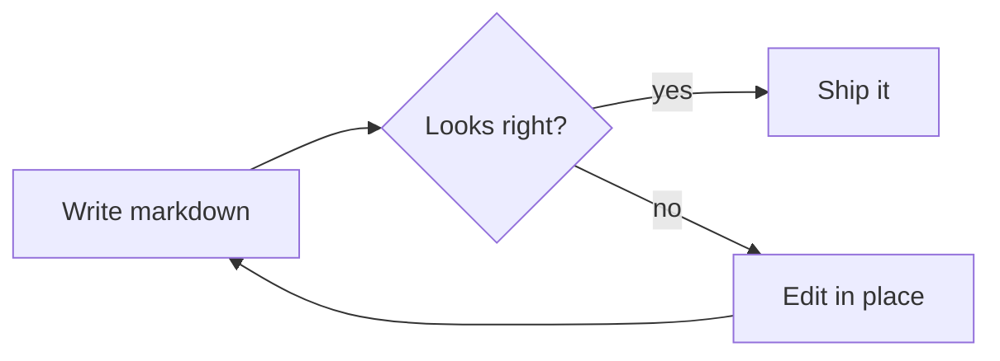

# Quoin Extensions

Standard Markdown covers most writing. Quoin adds a few things on top —
each one still a plain-text convention that stays readable in any editor.
This document is a live example: click into any block to see its source.

## Review marks

Quoin renders CriticMarkup as review chrome, so tracked changes live as
literal bytes in your file — no database, no lock-in. There are five marks:

- Insertion: The launch is {++now++} scheduled.
- Deletion: The old copy {--was too long and rambling--} reads better.
- Substitution: We {~~cannot~>can~~} ship this quarter.
- Highlight: Please revisit {==this whole sentence==} before publishing.
- Comment: attach a note to a highlight {==like this==}{>>Needs a citation.<<}

You don't type these by hand. Select some text and use **Format ▸ Review**:

| Gesture | Shortcut |
| :--- | :--- |
| Add Comment… | ⇧⌘M |
| Suggest Replacement… | ⇧⌘R |
| Suggest Deletion | — |
| Highlight for Review | — |
| Suggest Edits (mode) | ⌃⌘R |

Turn on **Suggest Edits** and every edit you make is captured as a
suggestion instead of a direct change — a reviewer (or an AI assistant) can
then accept or reject each one.

## Front matter

A document may open with a YAML front-matter block between two lines of
three dashes. Quoin shows it as a compact chip above the title; click the
chip — or open the **Properties** inspector (the third sidebar tab) — to
edit the fields with typed editors (dates, toggles, lists).

```text
---
title: My Note
tags: [ideas, draft]
created: 2026-07-17
---
```

The front matter at the top of *this* document is a real example.

## Math fences

Inline math uses single dollars, display math uses double:

Euler's identity, inline: $e^{i\pi} + 1 = 0$.

$$
x = \frac{-b \pm \sqrt{b^2 - 4ac}}{2a}
$$

Click **‹/› edit** on the equation to change the LaTeX with a live preview
beside your cursor. Coverage is large (~400 commands); anything not yet
typeset degrades to a tidy source card rather than breaking.

## Diagram fences

A ` ```mermaid ` fenced code block renders as a native diagram — no web
engine, no network:



Flowchart, sequence, class, state, ER, gantt, pie, and mindmap diagrams are
supported. Click **‹/› edit** to change one and watch it redraw as you type.

## Highlights and callouts

- Highlight prose with `==double equals==` — it renders as ==a highlight==.
- Callouts use a blockquote with a tag:

> [!TIP]
> `NOTE`, `TIP`, `IMPORTANT`, `WARNING`, and `CAUTION` are all supported.

## HTML comments

An HTML comment is hidden in the reading view and revealed when you click
into it, so you can leave notes to yourself without them showing up:

<!-- This note is invisible until you click into this block. -->

---

Everything here is a plain `.md` file on disk. Open this document in any
other editor and the marks, front matter, and fences are all still there as
ordinary text.
