# What you can do with Quoin

A tour of Quoin organized by what you *do* — write, review, organize, read,
reference — not by how it's built. Every feature names its keyboard shortcut
and describes the real behavior you'll see. New to Quoin? Start with
[Getting started](getting-started.md) for a five-minute walkthrough instead.

Quoin is a native macOS WYSIWYG editor for plain `.md` files. The file on disk
is the source of truth; what you see is a live projection of it. There is no
web view, no JavaScript at runtime, and nothing leaves your machine. When you
edit, you're editing the markdown — the rendered view just re-projects it.
See [architecture](../reference/architecture.md) for the machinery behind
this, and [PRODUCT.md](../PRODUCT.md) for the full capability spec this tour
summarizes.

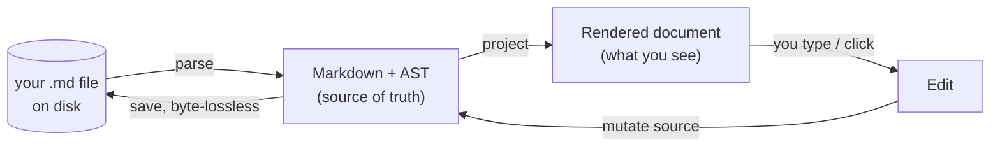

Because the file *is* the document, any tool that writes markdown — a
collaborator, a script, or an AI agent — writes Quoin documents. That is the
foundation of the review loop, the feature nothing else quite does.

The four clusters below map onto one flow: you write in a live projection,
optionally route changes through review, organize documents around it, and
read it back comfortably.

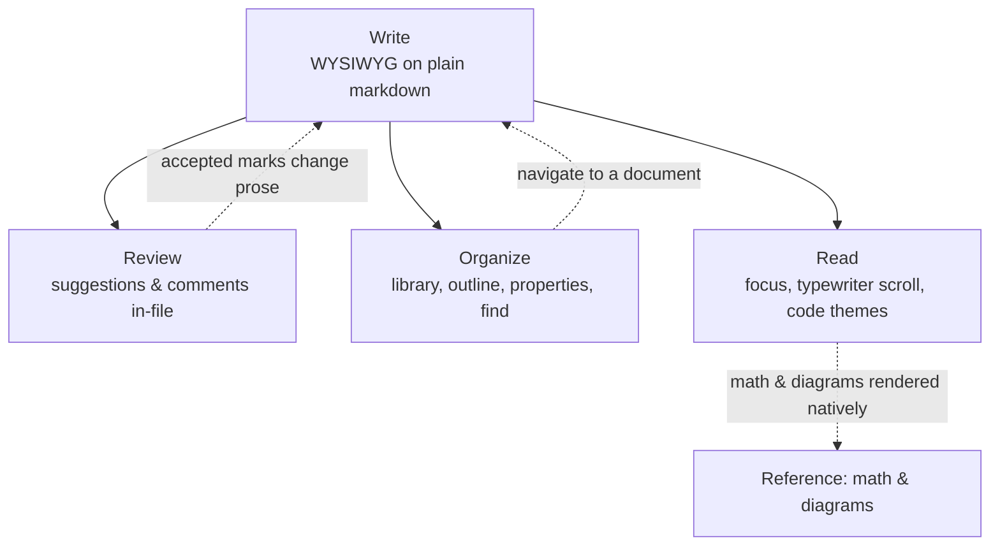

---

## Write

Quoin is WYSIWYG on plain markdown. The rendered document *is* the editor, and
the file on disk stays clean markdown you own.

- **Rich rendering as you read** — headings, emphasis, lists, tables, task
  lists, callouts, highlights, footnotes, code with syntax highlighting, math,
  and Mermaid diagrams, all drawn natively (no web view, no JavaScript).
- **Edit in place** — click into any block and it reveals its literal markdown
  source, character-for-character with the file. Edit it, click away, it
  re-renders. The line you're on never jumps on screen. This projection model
  — rendered by default, literal source while active — is documented in
  [editor modes](../design/editor-modes.md).
- **Formatting that writes real markdown** — every command below edits the
  source, so the file stays clean and portable:

  | Action | Shortcut | What it writes |
  | :--- | :--- | :--- |
  | Bold | ⌘B | `**text**` |
  | Italic | ⌘I | `*text*` |
  | Highlight | ⇧⌘H | `==text==` (cycles a color palette) |
  | Add Link | ⌘K | `[text](url)` |
  | Edit Source / Done Editing | ⌘↩ | toggles the caret block into raw markdown |
  | Move Block Up / Down | ⌥⌘↑ / ⌥⌘↓ | reorders whole blocks byte-exactly |

- **Structure commands** (Format ▸ Structure, while editing a block) — reshape
  the caret's block without hand-editing prefixes:

  | Action | Shortcut | What it does |
  | :--- | :--- | :--- |
  | Heading 1–6 | ⌥⌘1 … ⌥⌘6 | set the heading level (`#` … `######`) |
  | No Heading / Cycle Heading Level | menu | strip to a paragraph, or cycle none → 1 → … → 6 → none |
  | Toggle Bullet / Numbered List | menu | wrap the block's lines as `- ` / `1. ` items (or unwrap) |
  | Toggle Block Quote | menu | add or remove a `>` prefix on every line |
  | Toggle Checkbox | ⌃⌘↩ | flip `- [ ]` ⇄ `- [x]` on the caret's line (adds one to a plain line) |

- **List editing** — `Tab` / `⇧Tab` indent and outdent the current item;
  **Return** continues the list — bullets, incrementing numbers, `- [ ]`
  checkboxes (reset to unchecked), and `>` quotes — and Return on an empty
  item ends the list. All as byte-exact source edits.
- **Task lists** — click a checkbox; it toggles and writes `- [x]` back to the
  file.
- **Spell-check** — misspellings are underlined as you write (Edit ▸ Spelling
  and Grammar to toggle or correct). It only annotates — autocorrect and smart
  quote/dash substitutions stay off so your exact bytes reach disk.
- **Images** — drag an image file in, or **paste** a screenshot / copied image
  (⌘V). Quoin copies it into an `assets/` folder beside your document and
  inserts `` at the caret — the file stays a plain `.md` you can
  move as a folder.
- **Word-granular undo** — typing coalesces into word-sized undo steps, so `⌘Z`
  removes a word (or a backspaced run), not one letter at a time. The Edit menu
  names the step it will reverse — **Undo Typing**, **Undo Move Block**, **Undo
  Edit Properties** — and disables when there's nothing left to undo.
- **Block operations** — right-click any block for **Duplicate Block**,
  **Delete Block**, and **Move Block Up/Down**. Each is a byte-exact source
  splice.
- **Structural table editing** — right-click a table (or use the **Format ▸
  Table** menu) to edit it without counting pipes: **Insert Row Above/Below**,
  **Delete Row**, **Insert Column Left/Right**, **Delete Column**, **Move Row
  Up/Down**, **Move Column Left/Right**, **Align Column** (Left / Center /
  Right / None), and **Normalize Table** (re-pads every cell and regenerates
  the delimiter row). The row/column the command acts on is the one your click
  or caret is in. Existing cell text and per-column alignment always survive a
  structural edit; only the affected table is re-padded, and a ragged or
  malformed table degrades to a safe no-op rather than corrupting. The header
  row and last remaining column are protected — a table always keeps a header
  and at least one column.
- **Byte-lossless** — anything you don't touch is saved exactly as it was, down
  to whitespace and delimiter style. See
  [invariants](../reference/invariants.md).

### Why the file is the source of truth

Most editors keep an internal model — an attributed string, an HTML DOM — and
treat markdown as an import/export format. That makes round-trips lossy: open a
file, save it, and the byte layout shifts. Quoin never holds a second
representation. The markdown string and its parsed AST *are* the document; the
view is a pure projection. This is why an untouched paragraph survives edit →
save unchanged, and why an agent's edits and yours compose cleanly — you're
both writing to the same file.

---

## Review — the thing nothing else does

Suggestions and comments live *inside the markdown file* using RDFM /
CriticMarkup syntax. A collaborator or an AI agent can propose edits anywhere in
the document, and you triage them in a real UI — where every accept and reject
is one atomic, byte-safe edit to the file. Design notes:
[suggestions](../design/suggestions.md).

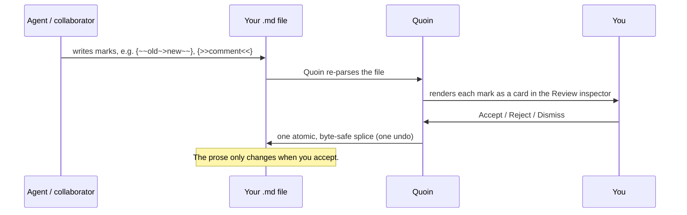

### The marks

Five kinds of mark render as tracked changes. The raw delimiters never appear in
the read view — you see the *change*, not the syntax.

| You (or an agent) write | Renders as |
| :--- | :--- |
| `{++inserted++}` | proposed insertion |
| `{--deleted--}` | proposed deletion |
| `{~~old~>new~~}` | proposed replacement |
| `{>>comment<<}` | a comment |
| `{==highlight==}` | a highlight |

### The Review inspector

The right-hand inspector has three modes — **Outline**, **Review**, and
**Properties** — toggled with ⌥⌘0. In **Review** mode, every mark in the
document is a card showing its author and relative time.

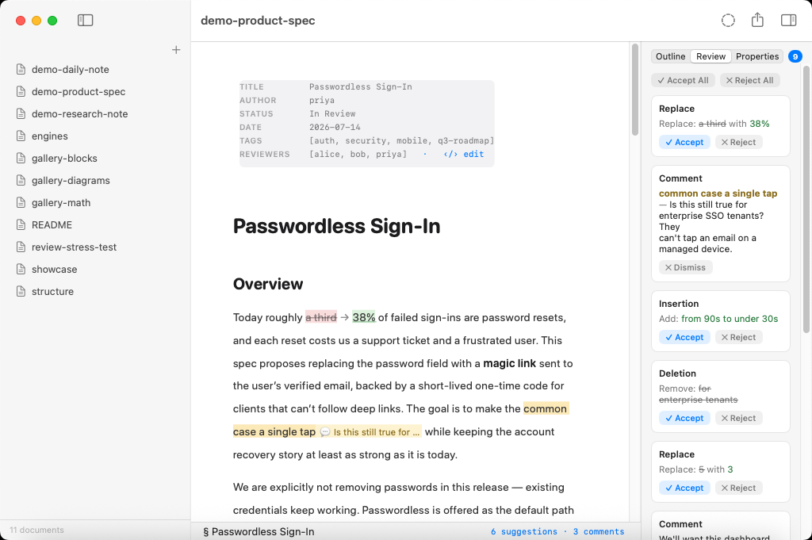

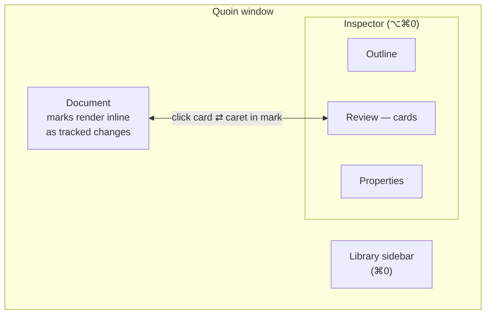

- **Per-card actions** — **✓ Accept**, **✕ Reject**, or **✕ Dismiss**. Bulk
  actions **✓ Accept All** and **✕ Reject All** sit at the top. Each resolution
  is one atomic edit, so one ⌘Z undoes it.
- **Card ↔ document linkage** — click a card to scroll its mark to center and
  flash an accent ring around it; put the caret inside a mark and its card
  highlights. When you resolve something offscreen, the view scrolls to where
  the change landed and pulses it.
- **History that's never lost** — resolved items are recorded in the file
  itself as RDFM endmatter (`status: resolved`), so the record is portable and
  agent-readable, and the Review tab stays available once any history exists.

### Suggest without touching the prose

Select text and use the **Format ▸ Review** menu (or right-click) to annotate
without changing what the document says. The prose only changes when someone
accepts the mark.

| Gesture | Shortcut | Effect |
| :--- | :--- | :--- |
| Add Comment… | ⇧⌘M | wraps the selection in `{>>…<<}` |
| Suggest Replacement… | ⇧⌘R | proposes `{~~old~>new~~}` |
| Suggest Deletion | — | proposes `{--…--}` |
| Highlight for Review | — | wraps the selection in `{==…==}` |
| Suggest Edits (mode) | ⌃⌘R | see below |

**Comment on opaque blocks** — code, tables, diagrams, and math can't hold
inline marks (marks must never be injected into runnable content). Right-click
one and choose **Comment on Block…**; Quoin drops a `{>>comment<<}` paragraph
next to the block instead.

### Suggest Edits mode

Toggle **Suggest Edits** (⌃⌘R) and your ordinary typing *becomes* suggestions
instead of edits. Insertions land as `{++…++}`, deletions as `{--…--}`, and
overwrites as `{~~old~>new~~}`. A single keystroke grows the current mark rather
than minting a fresh one each time. An accent **SUGGESTING** chip shows while
the mode is on, so you always know your edits are being tracked.

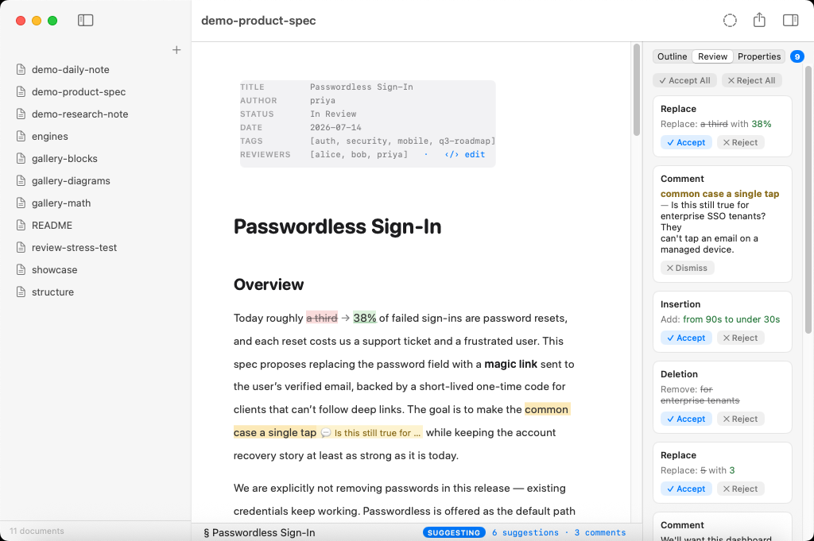

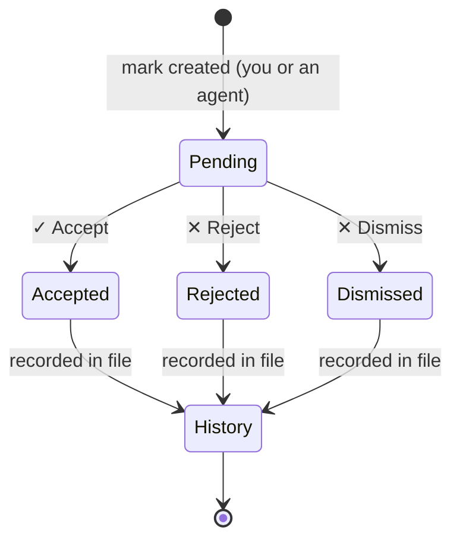

### Why marks in the file matter

Because suggestions are just text in your markdown, there's no proprietary
review database and no service to sync with. The review loop *is* the agent
interface: point an agent (like Claude Code) at your document, it writes marks,
and the cards appear in your panel. Every resolution is computed inside the
document session at apply time against the current file — if the underlying text
has drifted, Quoin refuses rather than splicing stale offsets. Candidate edits
are re-parsed and rejected unless exactly the expected mark comes back, so a
resolution can never quietly corrupt the document.

---

## Organize

- **Library** — pick a folder and its tree becomes your sidebar (⌘0). Folders
  are directories; documents are plain files. **Open Folder in New Window** (in
  the File menu) gives each window its own folder, restored on relaunch.
- **Open in Finder** — Quoin registers as a Markdown *editor*, so it appears in
  Finder's **Open With ▸ Quoin** for any `.md` file and can be set as your
  default Markdown app if you want. It does **not** grab `.md` on install,
  though: double-clicking keeps opening whatever app you already chose, and Quoin
  stays one *Open With* away until you pick it yourself — it coexists politely
  with Typora, VS Code, iA Writer, and the rest. A plain `.txt` opened via *Open
  With* works too, but Quoin never claims to own plain text. Every open — Finder,
  ⌘O, the sidebar, a dropped file — lands as a tab in the current window.
- **Open Recent** — **File ▸ Open Recent** (and the Dock icon's right-click menu)
  list the documents you opened most recently, whether you opened them from the
  library, from Finder, or by any other route; picking one reopens it as a tab.
  Files you've since deleted drop off the list. **Clear Menu** empties it.
- **Drag out to Finder** — drag any document (or folder) from the sidebar
  straight into the Finder or another app. Because documents are plain files,
  the drop is a real copy of the file — your original stays put in the library.
  **File ▸ Show in Finder** reveals the document you're editing without hunting
  for it in the tree (the sidebar's right-click **Reveal in Finder** does the
  same for any selected file or folder).
- **Manage documents** — right-click any document or folder in the sidebar for
  **Rename**, **Duplicate**, **Reveal in Finder**, and **Move to Trash**.
  Duplicate copies the file to the next free ` 2`, ` 3`… name beside the
  original (never overwriting) and opens the copy. Move to Trash uses the
  system Trash, so a deleted document is recoverable from the Finder — it is
  never permanently erased — and any open tabs for it close automatically.
  The same **Duplicate** and **Move to Trash** actions sit in the File menu and
  act on the current document. (Neither carries a keyboard shortcut: ⌘⌫ is
  deliberately left unbound because it would shadow AppKit's in-line
  delete-to-start-of-line while editing.)
- **`quoin://` links** — a `quoin://open?path=…` link opens a document in the
  library. `path` may be relative to the library root
  (`quoin://open?path=Notes/Today.md`) or an absolute path *inside* it. Links
  that point outside the library, use `..` to climb out, or name a file that
  isn't there are refused — Quoin only reaches files inside the folder you
  granted it. Handy for scripts, notes apps, and `Reveal in Finder`'s companion:
  a stable way to jump back to a document.
- **Services menu** — select text in *any* app, then choose **Services ▸ New
  Quoin Document with Selection** (in that app's application menu or its
  right-click **Services** submenu). Quoin creates a new document in your
  library, seeded with the selection, and opens it. The document is named from
  the selection's first line — a leading heading or list marker is dropped so
  the filename stays tidy. With no library configured, Quoin asks where to save
  the new file instead. The write lands in the folder you already granted
  Quoin — no new permission prompt.
- **Handoff** — the document you're editing is published as the app's current
  activity, so it shows up in Handoff, Siri Suggestions, and window restoration
  and can be resumed from the Mac's Handoff banner (and, once an iOS/iPadOS
  reader ships, from another Apple device). The handle it carries is the same
  boundary-respecting `quoin://` link — never an absolute path or a
  security-scoped bookmark — so resuming re-resolves inside the library you
  granted. A document outside a granted library publishes no activity.
- **Spotlight** — Quoin indexes your library so system Spotlight finds
  documents by **title, headings, front-matter tags, and body snippets**. Tap a
  Quoin result in Spotlight and the document opens in Quoin. The index is
  **private and on-device** — nothing is uploaded, and Quoin makes no network
  request for it — and it stays in sync as you write: it updates on every scan,
  and items for files you move or delete are removed automatically. Only `.md`
  documents inside your granted library are indexed, and a tapped result opens
  through the same in-library `quoin://` resolution as everything else, so it can
  never reach a file outside the folder you granted.
- **Shortcuts & Siri (App Intents)** — Quoin exposes a small set of actions to
  the Shortcuts app, Spotlight, and Siri, so you can automate common library
  tasks by voice, on a schedule, or from a keyboard shortcut. Five actions ship
  ready to use, each with natural-language phrases (all mentioning "Quoin"):
  - **Create Note** — "Create a note in Quoin" — makes a new note (from a title
    and optional body) and opens it.
  - **Append Text to Note** — "Add text to a Quoin note" — adds text to the end
    of a note as a new line. It's a real, undoable, byte-lossless edit through
    the same session path as typing — never a blind file rewrite — so an append
    made while the note is open surfaces the usual reload/merge banner rather
    than clobbering unsaved work.
  - **Open Note** — "Open a note in Quoin" — brings Quoin forward with the note.
  - **Search Library** — "Search Quoin for…" — fuzzy title + content search,
    returning notes you can pass straight into another action.
  - **Export Note** — exports a note as HTML, Markdown, or plain text and hands
    back the file.

  The document actions take a **Note** picker backed by your library's index —
  the same scan the sidebar and quick open use — so notes resolve by name or
  path. Everything stays local: the actions read and write only inside the
  library folder you granted, with no network access, and they target your
  most-recently-used library folder.
- **Quick Look thumbnails & previews** — with Quoin installed, `.md` files show
  a rendered thumbnail in Finder and open panels, and a rich preview when you
  press Space (Quick Look) in Finder or Spotlight — headings, prose, code,
  tables, and callouts, with lightweight placeholders standing in for diagrams
  and math (a `◆ Mermaid diagram` chip, the LaTeX for an equation). It is a
  fast, bounded mode of the same engine — the input is capped in size before
  parsing and the expensive diagram/math layout is skipped entirely, so even a
  huge file previews quickly. (There's no per-render wall-clock deadline inside
  the extension; the system's own Quick Look agent is the final watchdog for a
  stuck preview.) The extensions get read-only access to just the file being
  previewed; nothing leaves your machine.
- **Outline** — a live heading tree (⌥⌘0, Outline mode). Manual collapse sticks,
  and the current-section highlight follows your reading position; when you
  collapse an ancestor, Quoin highlights that ancestor instead of re-expanding.
  The tree is fully keyboard-operable: ↑ / ↓ move a focus cursor through the
  visible rows, → expands a section (or steps into its first child), ←
  collapses it (or climbs to the parent), and Return jumps the document to the
  focused heading. VoiceOver announces each section's expanded/collapsed state.
- **Properties** — the third inspector mode edits YAML front matter as a
  key/value panel with type-appropriate editors — date picker, toggle, number
  field, comma-separated list — plus an **Edit as Text** escape hatch. It's
  byte-conservative: a value that doesn't parse cleanly as its type stays a
  string, and typed writes preserve the original precision. In the document,
  front matter renders as a tidy field grid.

  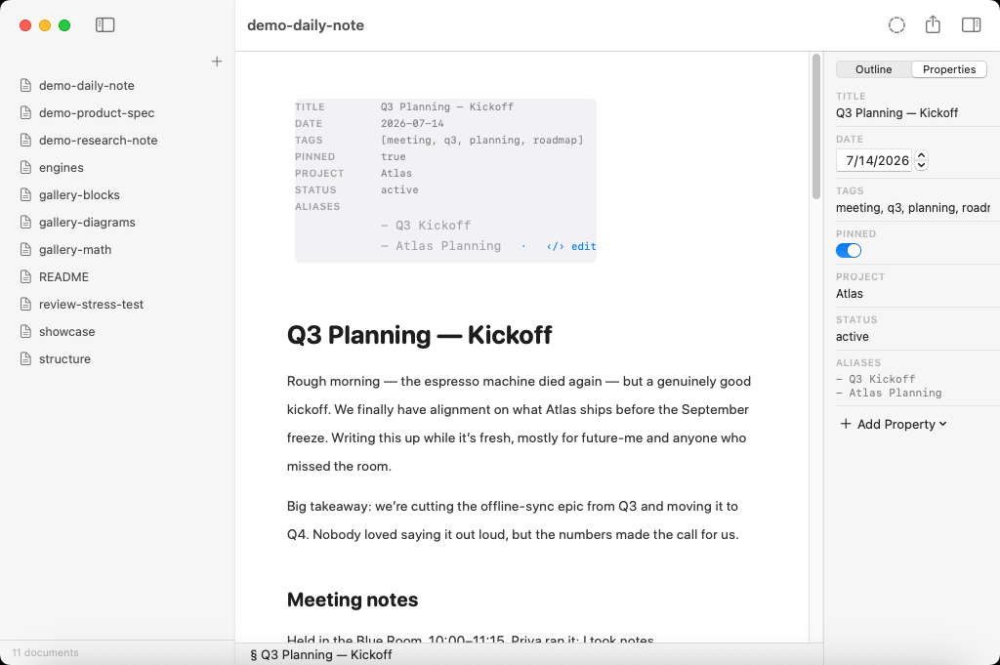

- **Find & search**:

  | Action | Shortcut |
  | :--- | :--- |
  | Find in Document… | ⌘F |
  | Find & Replace… | ⌥⌘F |
  | Find Next / Previous | ⌘G / ⇧⌘G |
  | Search Library… | ⇧⌘F |
  | Quick Open… | ⇧⌘O |
  | Daily Note | ⌘D |

  Find-in-document (⌘F) shows a live match count as you type:

  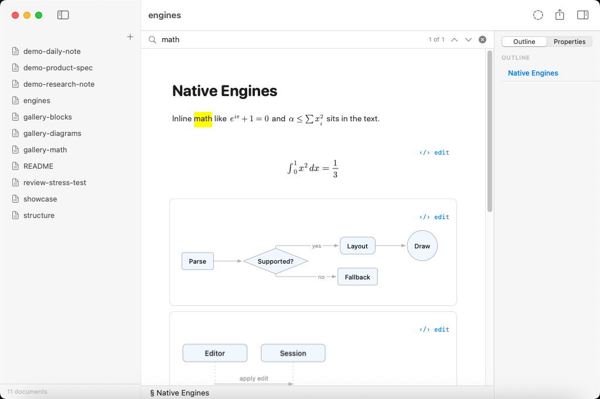

  The find bar carries four option toggles that apply to both the live
  highlight/count and to Replace:

  | Toggle | What it does |
  | :--- | :--- |
  | **Aa** — Match Case | Case-sensitive matching (off = case-insensitive). Accents are always significant — `cafe` never matches `café`. |
  | **W** — Whole Word | Match only complete words (bounded by non-word characters). |
  | **.\*** — Regular Expression | Interpret the query as a regular expression; an invalid pattern turns the field red and matches nothing. |
  | **In Selection** | Limit find & replace to the current text selection. |

  Match Case, Whole Word, and Regex are sticky across sessions; In Selection
  is per-use. The same option set drives the highlight, the “_N of M_” count,
  and Replace / Replace All, so the count you see is exactly what Replace All
  acts on. Replace reports how many occurrences it changed (“Replaced _N_”).
  Regex replacement text is inserted literally — `$1`-style capture-group
  substitution is not performed.

  Search Library (⇧⌘F) runs full-text search across every document in the folder:

  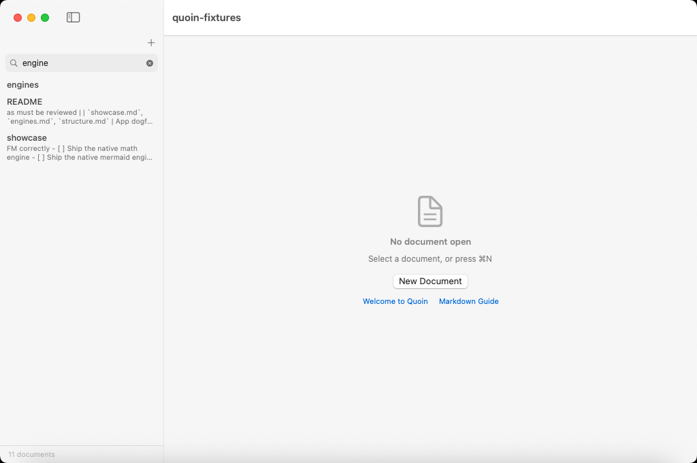

  Both Quick Open and Search Library are driven entirely from the keyboard: ↑ / ↓
  move the highlighted result (wrapping around the ends), Home / End jump to the
  first or last, Return opens the highlight, and Escape dismisses. No reaching for
  the mouse to pick a match.

- **Tabs & navigation** — document tabs (**Select Tab 1–9** ⌘1–9 pick a tab by
  position; **Show Next Tab** ⌃⇥ and **Show Previous Tab** ⌃⇧⇥ cycle through
  them — all in the Window menu), jump history **Back** ⌘[ and **Forward** ⌘],
  a breadcrumb path, and footnote click-to-jump with a hover preview and an ↩
  backlink to return. The gathered footnote definitions at the foot of the
  document are read-only: a click there is a no-op (you edit a footnote by
  changing its `[^id]: …` line in the body flow), not an in-place reveal.

  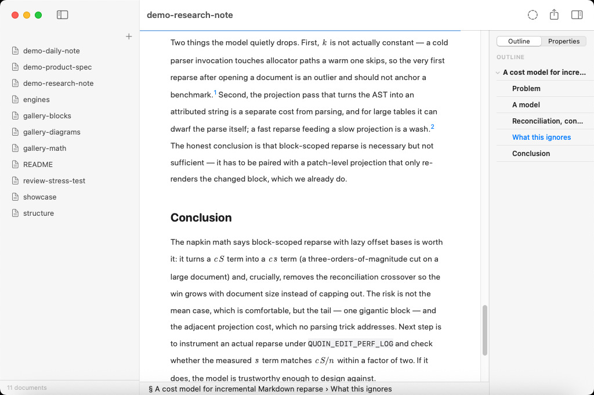

---

## Read comfortably

| Feature | Shortcut | What it does |
| :--- | :--- | :--- |
| Focus Mode | View menu / toolbar | dims everything but the current block (per-window) |
| Sentence Focus | View menu | narrows the focus to the current sentence (needs Focus Mode) |
| Typewriter Scrolling | ⌥⌘T | keeps the active line vertically centered (per-window) |
| Zoom In / Out | ⌘= / ⌘− | scales the reading text up or down |
| Actual Size | ⌃⌘0 | resets the reading text to 100% |
| Wrap Lines | View menu | wrap long lines to the column, or let them run and scroll horizontally |
| Status Bar | — | word count, reading progress, and goals |

Focus Mode, Sentence Focus, and Typewriter Scrolling are per-window — turning
one on in one document doesn't flip it in your other open windows.

Text zoom changes only how large the document reads on screen — it's a viewing
preference, not an edit. Exports (PDF, RTF) and print always render at 100%, so a
comfortable reading zoom never leaks into the files you share.

Twelve selectable code themes are available for fenced code blocks; the default
follows the app's light/dark appearance. A reading-progress hairline and
word-count goals live in the status bar.

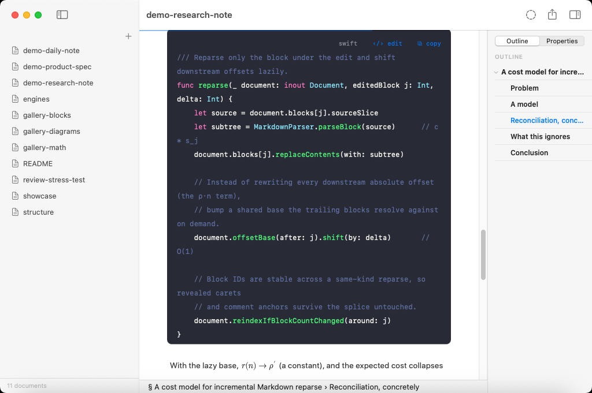

Every rendered element — front matter, callouts, tables, code, math, diagrams —
carries its own light and dark styling; there's no separate "dark mode" theme
to fight with your content.

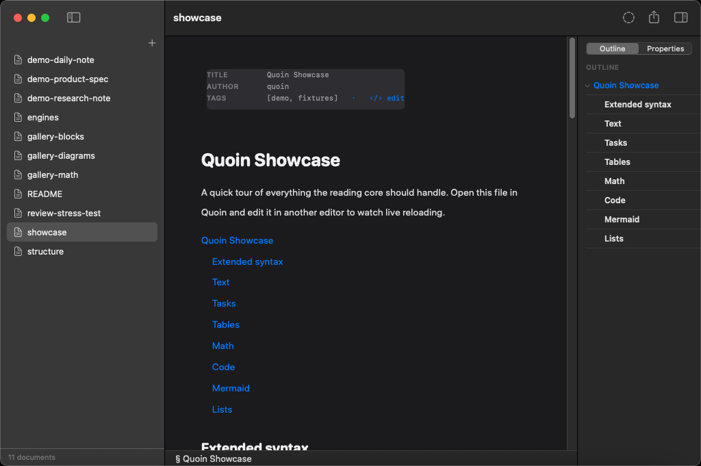

---

## Accessibility

Quoin honors the system accessibility settings from **System Settings ▸
Accessibility** — no separate in-app switches to find:

| Setting | What Quoin does |
| :--- | :--- |
| **Larger text** (Dynamic Type) | The app chrome — sidebar, outline, document tabs, status bar, inspector, and dialogs — scales with your preferred text size. The design's type ramp is preserved (everything grows together, in proportion), so nothing looks lopsided at large sizes. |
| **Reduce Motion** | Sidebar and outline reveals, the formatting pill, and block flip transitions apply instantly instead of animating. |
| **Reduce Transparency** | Vibrant surfaces (Quick Open, the find and replace bars) fall back to opaque backgrounds. |

Dynamic Type scales the *chrome*; the document body has its own independent
reading zoom (⌘= / ⌘−, above). The two never fight, and neither changes the
bytes on disk.

### VoiceOver and the rendered structure

The document is one text view, but VoiceOver hears its structure:

- **Jump between headings.** With VoiceOver on, the document exposes a
  **Headings** rotor. Open the rotor (VO‑U), pick **Headings**, and flick
  up/down (or VO‑←/→) to move directly from one heading to the next — each is
  announced with its level and title (*"Heading level 2, Introduction"*), so
  you can skim the outline without arrowing through every line.
- **Move by structure.** A companion **Landmarks** rotor flicks through the
  other structural blocks — code blocks, tables, lists, callouts, quotes,
  diagrams, and equations — announcing what each region is (*"Table, 3 columns,
  4 rows"*, *"Note callout"*, *"Ordered list, 2 items"*, *"Code block, swift,
  12 lines"*) so you can navigate the document's shape, not just its lines.
- **Equations and diagrams speak.** A rendered equation reads its spoken‑math
  description (*"Equation, x squared plus one"*) and a diagram reads a
  narration of its type and leading content (*"Flowchart with 3 nodes and 2
  connections: Start, Decision, Done"*) — never an unnamed "image."
- **The ✓ done chip is a real control.** When a block is open for editing,
  VoiceOver finds the *Done editing* button and can press it to commit.

Deferred for a later pass: per‑*element* rotors that step through individual
tables, links, and tasks (beyond the block‑level Landmarks rotor);
accessibility containers grouping the sidebar / outline / find bar; and
alternate actions on hover‑only controls (tab close, copy‑code).

---

## Reference: math & diagrams

Math and diagrams are rendered natively — no MathJax, no KaTeX, no Mermaid.js.
Quoin edits them in place with a live side-panel preview (see
[embed editing](../design/embed-editing-ux.md) for how the source and preview
panes stay in sync): the source reveals beside a rendered pane, and the last
good render is held while your mid-edit source is temporarily invalid, so the
panel never flashes blank. Anything unsupported degrades to a labeled source
card with a specific reason — never a blank, never a crash.

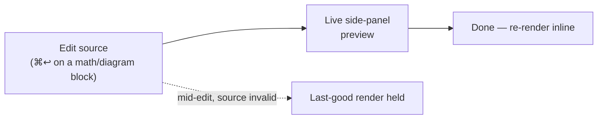

- **Math** — LaTeX via
  **[Vinculum](https://github.com/2389-research/Vinculum)**, Quoin's own
  TeX-style typesetting engine (~400 commands: fractions, roots, scripts, big
  operators with correct limits, matrices, alignment environments). Inline
  `$…$` and `\(…\)`, display `$$…$$` and `\[…\]`. The full coverage matrix
  lives in Vinculum's docs.

  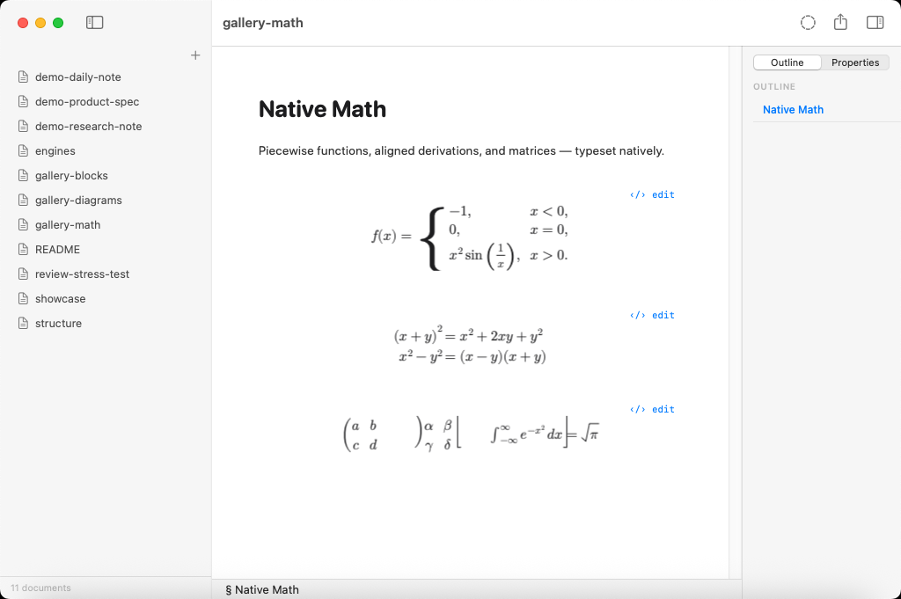

- **Diagrams** — Mermaid via
  **[MermaidKit](https://github.com/2389-research/MermaidKit)**, parsed and laid
  out natively (flowcharts, sequence, state, and more). Front-matter
  `title`/`config` and `accTitle`/`accDescr` are supported. The full
  diagram-type catalog lives in MermaidKit's docs.

  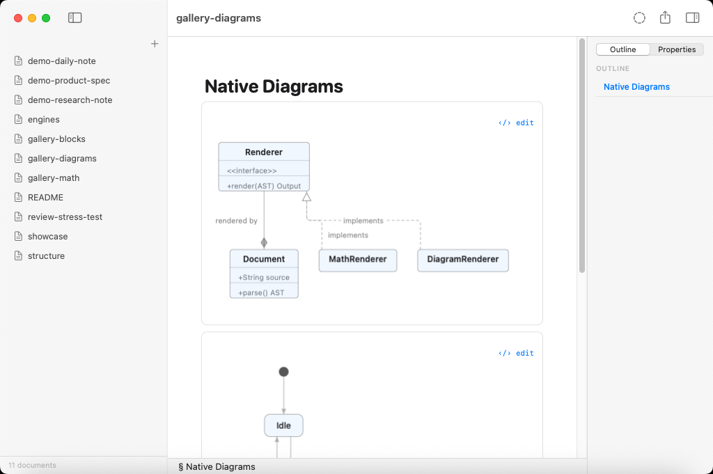

Both engines are first-party, GitHub-hosted dependencies — see
[dependencies](../reference/dependencies.md) for why Quoin keeps its
dependency list this short.

### Why native rendering, not a web view

A web view would mean bundling a JavaScript engine, shipping third-party
renderers, and paying a startup and memory cost on every diagram and equation —
plus a privacy surface Quoin refuses. Native first-party engines keep everything
local, fast, and consistent with the rest of the document's typography, and they
degrade predictably instead of failing in an opaque sandbox.

---

## Export & interop

- Export to **PDF**, **HTML**, **Markdown** (round-trip), **RTF**, or **plain
  text** (via **Export…**, ⇧⌘E), and **Print…** with ⌘P. **Page Setup…** (⇧⌘P)
  sets the paper size and orientation the print job uses. Exports render at
  100% regardless of the reading-view zoom.

  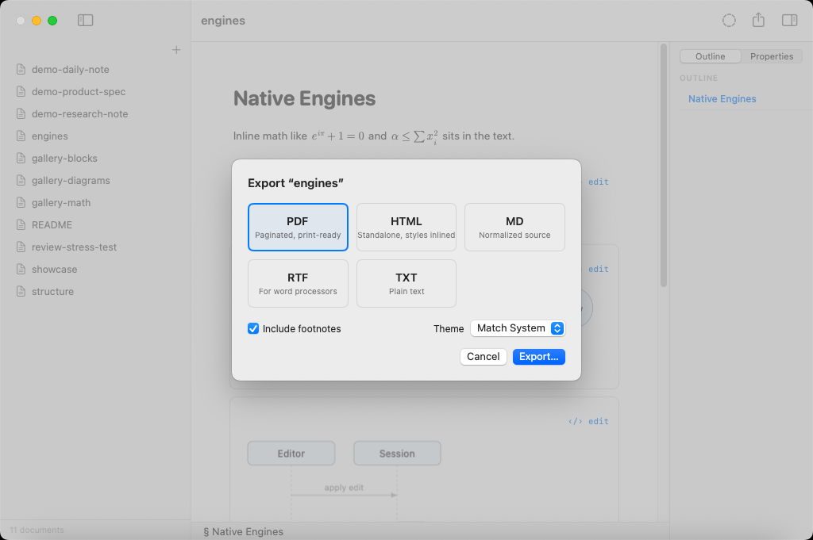

- **Local images travel with the export.** A `` reference
  is resolved relative to the document's folder and carried into the output:
  **HTML** inlines the image as a base64 `data:` URI so the file stays
  self-contained; **PDF** and **Print** draw the image just as the reader does;
  **Markdown** keeps the `` reference verbatim. Plain **RTF** cannot embed
  raster images, so it shows a visible named placeholder (the alt text and the
  path) instead of a silent gap. Remote (`http(s)://`) images stay as external
  references — Quoin never fetches them.

- **Share** the current document through the system share sheet (AirDrop, Mail,
  Messages, or any share extension) from the toolbar Share button.

- Everything is a plain file. Any tool that writes markdown — or RDFM /
  CriticMarkup — produces Quoin documents. There is no lock-in and no service:
  files on disk are the whole story.
