# Quoin architecture

This is the contributor-level map: how a markdown file becomes pixels, how an
edit flows back to disk, and which invariants hold everything together. The
visual/interaction spec lives in `docs/design/handoff.md`; this document is
about the machinery. The load-bearing design decisions each have a one-page
[ADR](adr/README.md) recording their rationale — this map cites them where a
choice would otherwise look arbitrary.

## The one rule

**The markdown source string (plus its AST) is the only source of truth.**
The attributed string on screen is a *projection* of that source. Nothing in
the app ever treats the text view's contents as data: every keystroke is
intercepted, converted to a source edit, applied to the source, re-parsed, and
re-projected.

Why go to this trouble instead of editing an attributed string directly? Three
consequences fall out of it, and none of them is achievable the other way:

- **The round-trip is [byte-lossless](invariants.md).** Untouched regions of
  the file are never re-serialized, because the file is never serialized
  *from* the view at all — only the bytes an edit actually spans ever change
  on disk. Your document is the file you wrote, not a lossy re-emission of a
  rich-text model. The full guarantee, and the tests that enforce it, are
  catalogued in [`invariants.md`](invariants.md).
- **The `.md` file is portable and permanent.** It opens in any editor,
  diffs cleanly in git, and outlives Quoin. Quoin is a lens over your file,
  not a container that owns it.
- **Every feature is "just markdown."** Comments, suggestions, front-matter
  Properties, callouts, math, and diagrams are all encodings *in the text*.
  There is no sidecar database to corrupt or desync, and a collaborator (or an
  agent) editing the raw file sees exactly what Quoin sees.

This is [ADR 0001](adr/0001-source-string-truth.md).

## Dependencies

Quoin has exactly **one third-party dependency** and two first-party packages
of its own (all pinned in `Package.swift`); the full graph and the policy
behind it live in [`dependencies.md`](dependencies.md):

| Package | Version | Role | Policy |
| --- | --- | --- | --- |
| `swift-markdown` (swiftlang) | `from: 0.8.0` | CommonMark/GFM parse via cmark-gfm | the one allowed third-party dep |
| `MermaidKit` (2389-research) | `from: 2.2.0` | Mermaid diagrams (`MermaidLayout` + `MermaidRender`) | first-party, exempt |
| `Vinculum` (2389-research) | `from: 1.5.0` | LaTeX math (`VinculumLayout` + `VinculumRender`) | first-party, exempt |

[MermaidKit](https://github.com/2389-research/MermaidKit) and
[Vinculum](https://github.com/2389-research/Vinculum) are Quoin's own published
packages, consumed from GitHub exactly like any other host app would — their
engines are versioned and CI-tested on their own, so they are exempt from the
dependency policy (the policy script allowlists them). The
one-third-party-dependency rule still bites for anything genuinely external: a
new outside dependency requires a written TRD case first, and the default
answer is no. Each first-party package splits a
platform-free layout product (Foundation-only, Linux-clean) from an Apple-only
render product; QuoinCore `@_exported import`s the layout product of each
(`MermaidReexport.swift`, `VinculumReexport.swift`) so their public types stay
reachable through `import QuoinCore`. See
[ADR 0003](adr/0003-first-party-engines.md).

## Data flow

The edit loop is a one-way cycle: keystrokes never mutate the view directly —
they become source edits, and the view only ever receives re-projections.

<picture>
  <source media="(prefers-color-scheme: dark)" srcset="../images/data-flow-dark.png">
  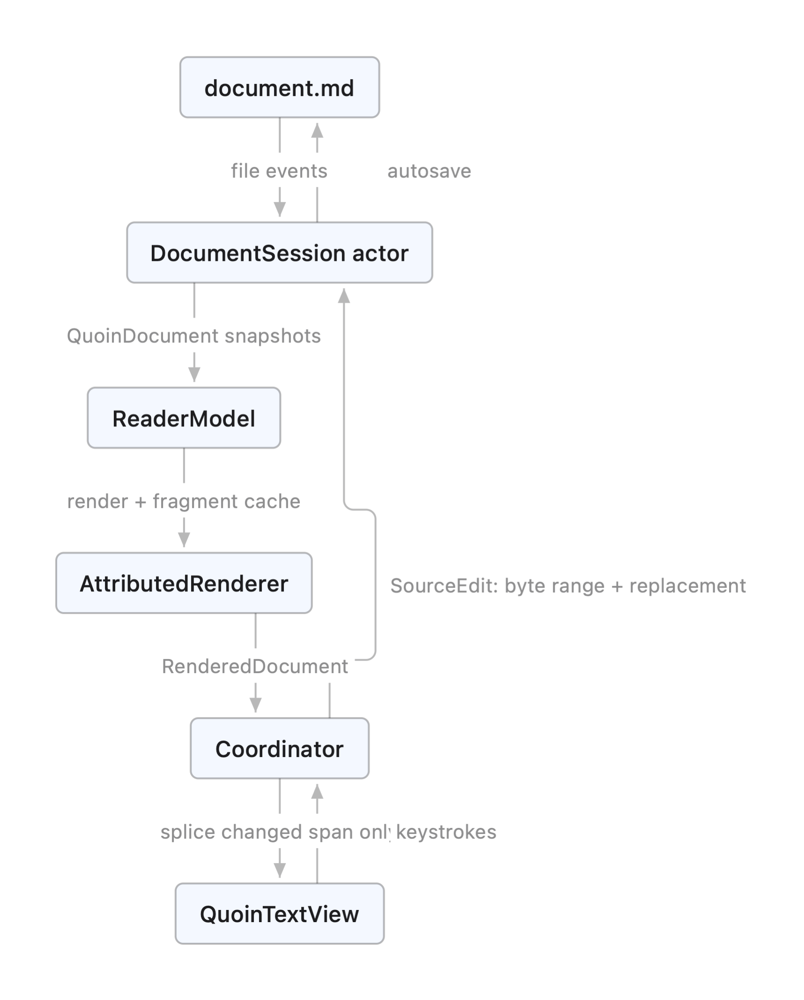
</picture>

Rendered by Quoin's own native Mermaid engine from the source below, so
this document doubles as a fixture. Regenerate with `QUOIN_DOC_DIAGRAMS=$PWD
swift test --filter testRenderDocDiagrams`.

Mermaid source

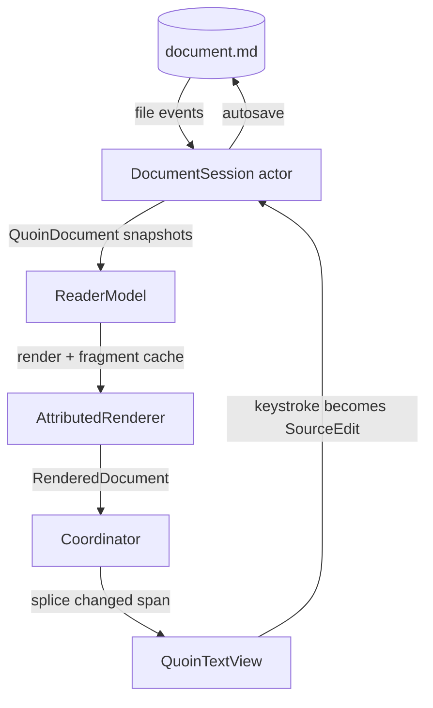

The four stages below — **parse, session, project, display** — are that cycle
read left to right. A keystroke enters at `Display`, becomes a `SourceEdit` at
`Session`, re-parses at `Parse`, re-projects at `Project`, and lands back at
`Display` as a splice. No stage ever reaches backward.

### Parse (QuoinCore)

`MarkdownConverter.parse` runs swift-markdown (cmark-gfm) and post-processes:

- **Source map.** Every block carries a `ByteRange` into the UTF-8 source.
  Block identity (`BlockID`) is `contentHash:occurrence` — stable across
  re-parses when content is unchanged, which is what the fragment cache and
  scroll anchoring key on.
- **Math scanning** happens against the *raw source slice*, not the parsed
  inline tree: cmark has no math extension and mangles `$a_b + c_d$` into
  emphasis. The scanner recognises `$…$`, `$$…$$`, `\(…\)`, and `\[…\]`
  (`MathScanner`, a Vinculum type re-exported through QuoinCore); the
  non-math remainder is re-parsed as inline markdown. Standalone display
  blocks (`$$`/`\[` alone on their lines, blank-line separated) are claimed
  from the raw source *before* cmark (`DisplayMathPrescan`, the same
  split-before-cmark precedent as front matter): a setext-lookalike interior
  line (bare `=`, `---`) would otherwise tear the span into paragraph +
  phantom heading + orphan tail. A span the scanner does not confirm as
  exactly one display segment is left to cmark untouched.
- **Extension post-passes** splice highlights (`==…==`), callout detection,
  front matter, `[TOC]`, and footnote gathering.

### Session (QuoinCore)

`DocumentSession` is an actor owning the live document: it applies
`SourceEdit`s, maintains source-level undo/redo, autosaves, watches the file,
and publishes immutable `QuoinDocument` snapshots. External changes while
edits are unsaved surface as a non-blocking conflict banner (keep mine / take
disk); self-inflicted file events are recognised by source hash. Reads and
writes go through `FileCoordination` (`NSFileCoordinator`) so a library synced
through iCloud/Dropbox/Drive doesn't race the sync daemon into "conflicted
copy" files; a coordinated read also pulls down an undownloaded iCloud
placeholder before opening rather than failing it as unreadable.

**External-change detection: watcher + presenter (#32).** Two channels feed
`reloadFromDisk()`, deliberately *complementary*, not redundant:

- `FileWatcher` (kqueue) is the authoritative low-level detector. It catches
  *every* write to the inode — including *uncoordinated* writers (a `vim` /
  `sed` save that never touches `NSFileCoordinator`), which a file presenter is
  not guaranteed to hear — and follows a live-inode move via `F_GETPATH`.
- `DocumentFilePresenter` (`NSFilePresenter`, Darwin-only) makes the app a
  first-class participant in file coordination: the sync daemon and other
  coordinating writers now coordinate *around* our accesses (relinquish /
  reacquire, deletion accommodation) and announce their writes through the
  coordinated channel. It is registered/deregistered over the same lifetime as
  the watcher (`startWatching` / `stopWatching`), held in a `Sendable`
  `FilePresenterHandle` so the session's nonisolated `deinit` can deregister it
  (`NSFileCoordinator` retains presenters strongly, so the presenter's own
  deinit is not a reliable backstop). Callbacks arrive off the actor on the
  presenter's `operationQueue` and hop on with a non-blocking
  `Task { await … }`, so the queue never stalls (a blocked presenter queue is
  the classic coordination deadlock).

The two never double-apply a change: both funnel into the idempotent
`reloadFromDisk()`, whose source-hash guard collapses a duplicate signal into a
no-op, and a conflict-while-dirty is deduped by `conflictOfferedHash` so the
banner fires once per distinct disk version. Self-writes are recognised twice
over — session-initiated coordinated reads/writes pass the session's own
presenter, which `NSFileCoordinator` never echoes back to it, and the existing
`selfWriteHash` still absorbs the kqueue echo of our own save. Linux keeps
building: the presenter class and coordinator calls are under
`#if canImport(Darwin)`, and the handle is an inert empty box there.

**Session ownership.** `OpenDocumentStore` is an app-global registry: exactly
ONE `ReaderModel` (and thus one `DocumentSession` / autosaver) per file, keyed
by the resolved + standardized URL and ref-counted across every window and tab.
A first-H1 rename re-keys the entry and broadcasts so every window re-points
its tab. Because the model outlives the transient editor view, switching tabs
keeps the session and undo history alive, and the editor stashes its scroll +
caret in the model (`ViewportSnapshot`) on teardown and restores them on
return. Sessions deliberately do **not** live inside keep-alive tab views —
that road was rejected for the corruption it invites; see
[ADR 0005](adr/0005-no-keep-alive-tabs.md).

**Keystroke fast paths.** `MarkdownConverter.parseAfterEdit` re-parses
block-locally for the two things a caret does all day: typing in a plain
paragraph and typing inside a fenced embed block (code / mermaid / math). Both
paths re-parse only the edited block's source slice with the real parser —
never a hand-rolled imitation (cmark's smart punctuation once made an imitation
diverge) — and self-calibrate: the old slice must reproduce the old block
exactly, and the new slice must stay one block of the same family, grown by
exactly the edit's byte delta. Anything structural (a new fence, a paragraph
turning into a list, a footnote in the document) falls back to the full parse;
conservative rejections are always safe. Container blocks below the edit get
their ids re-derived, because a container's `contentHash` covers its children's
ranges and moves with every byte inserted above it. The editing-latency
contract — every keystroke's core slice fits in a 60 Hz frame at ANY document
size, charts or not — is enforced in CI by `EditingLatencyTests` (strategy
assertions + wall-clock ceilings over generated small/medium/large/novel
fixtures) and, for the render slice, by `EditingRenderLatencyTests`. Budgets
and methodology are cataloged in [`performance.md`](performance.md).

`parseAfterEdit`'s decision is conservative by construction: every fast path
re-parses with the real parser and self-calibrates against the old slice
before it trusts the new one, so a wrong guess always degrades to the
always-correct full parse rather than corrupting the document.

**Structural source-edit engines.** Commands that mutate structure — not raw
keystrokes — are pure, platform-free builders in QuoinCore that turn a block's
SOURCE SLICE into a `SourceEdit`; the model rebases the edit onto the block's
absolute range and applies it through the same session pipeline, so undo,
byte-losslessness for untouched blocks, and re-projection are free. Three
families exist: `StructureEditing` (line-prefix edits — heading level,
list/quote/checkbox toggles), `BlockEditing` (move / duplicate / delete a whole
block, plus append-row/append-column table convenience), and — for #14 —
`TableEditing`'s structural table engine. That engine parses a GFM pipe table
(`TableEditing.parse` → a rectangular `ParsedTable` of header, per-column
`TableAlignment`, and body rows, CRLF-safe and tolerant of missing outer pipes
or ragged rows) and emits slice-relative edits for insert/delete row, insert/
delete column, move row/column, set a column's alignment, and normalize (re-pad
+ regenerate the delimiter row). Every operation re-renders the whole table
with normalized padding, so existing cell text and alignment always survive and
only the affected table is re-padded; a slice whose second line is not a valid
delimiter row is not a table, so every operation returns nil and the command is
a quiet no-op (the header row and the last remaining column are likewise
protected). The macOS reader surfaces the commands through the table
right-click submenu — `TableEditing.location` maps the click's rendered offset
(via `EditMapping` when the table is not the active block, 1:1 when it is) to a
grid row/column so the command targets the exact cell — and through the
**Format ▸ Table** menu, which targets the caret's cell. Because the engine only
produces source edits and does not touch the projection or reveal styler, the
viewport/caret and patch-vs-full invariants are unaffected. `TableEditing`'s
operations are exhaustively unit-tested (simple, aligned, ragged, malformed,
single-row, single-column, CRLF, escaped pipes) in `TableStructureEditingTests`.

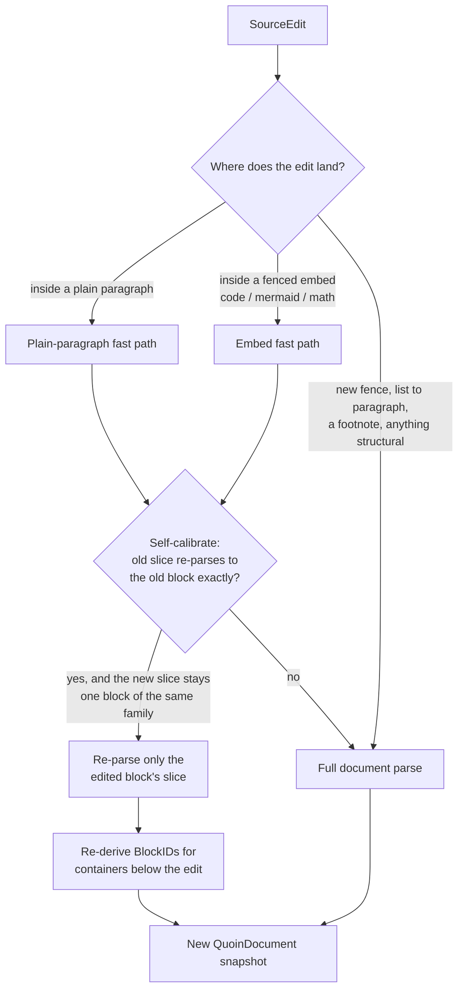

**Find & replace** has two coordinate spaces but ONE matcher. The visual
find scan (`ReaderCoordinator.performSearchScan`) highlights against the
rendered projection for navigation; replace (`SourceReplace`) rewrites the
raw source bytes and routes each change through the session, so undo and
byte-losslessness come free. Both draw their match rules — Match Case,
Whole Word, Regex, and the In-Selection scope — from the same
`TextMatcher` (`SearchOptions`), so the highlight/“_N of M_” count can never
recognize different occurrences than Replace-All does (the shipped
“two recognizers for one grammar diverge” bug). Invalid regexes match
nothing rather than crashing; regex replacement text is literal (no
capture-group substitution). `SourceReplaceTests` pins find-vs-replace
agreement across every option combination.

### Project (QuoinRender)

`AttributedRenderer.render` walks the block list and emits one attributed
string. The renderer's job is to spend as little work as possible per edit,
which it does by deciding, per projection, whether it can reuse cached
fragments, emit a bounded storage patch, or must fall back to a full render:

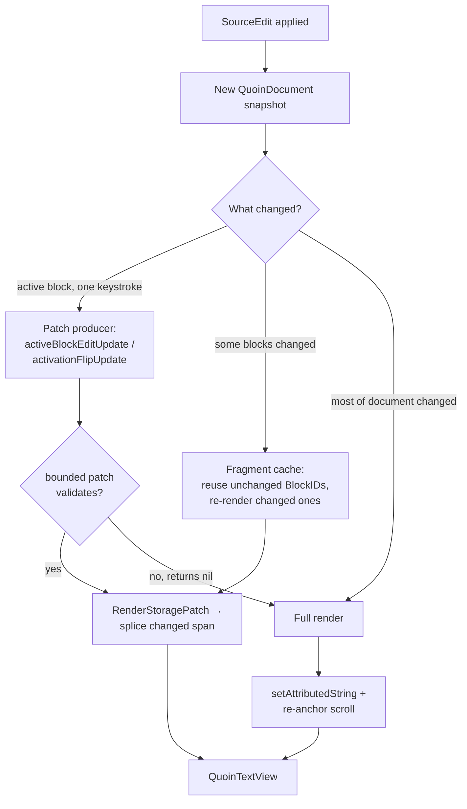

- Every block's range is tagged `QuoinAttribute.blockID`; block chrome is
  tagged `QuoinAttribute.blockDecoration` (drawn by the view, see below).
- **Fragment cache:** unchanged blocks (same `BlockID`) reuse their rendered
  fragment; only changed blocks re-render. Fragments holding unresolved async
  content (a still-decoding image placeholder) are deliberately *not* cached,
  or the placeholder would stick forever.
- **The active block** renders as literal source (`MarkdownSourceStyler`)
  instead of its projection — see "Editing model".
- **Presentation owner:** which block is editing and how it styles is decided
  ONCE per projection by the pure `presentation(for:activeBlockID:)`
  (`BlockPresentation.swift`) — `.rendered` or `.editing(flavor:chrome:)`,
  where the flavor table (prose / verbatim / preview) is the single place a
  block kind maps to reveal behavior. Exactly one block edits at a time (an
  invariant, not an accident).
- **Single derivations:** the block separator (characters AND clamp styling)
  comes from one `separator(after:before:revealedSlice:)`; the reveal's styler
  configuration comes from one `revealStylerConfig(kind:slice:)`, carried on
  `RenderedDocument.revealStyler` so the view-side caret-move restyle consumes
  it verbatim. Patch producers validate against these same derivations, so
  projection paths cannot drift (see Testing).
- **Patch producers:** the activation flip (`activationFlipUpdate`) and the
  per-keystroke active-block edit (`activeBlockEditUpdate`) build bounded
  `RenderStoragePatch`es IN the renderer, next to the render loop they must
  agree with. `RenderedDocument.storagePatches` + `patchBaseLength` carry them
  to the view; any validity failure returns nil and the model falls back to
  the always-correct full render.
- **Live preview retention** (mermaid/math side panel): the last-good artifact
  is `HeldPreview` — session state owned by `ReaderModel` and threaded through
  render passes as an explicit `inout`; the renderer holds no hidden mutable
  state. See [ADR 0004](adr/0004-side-panel-preview.md).

#### Threading: the full render runs off the main actor

`AttributedRenderer.render` is a pure, executor-independent function of its
inputs (document, active block, caret, fragment cache, held preview), so the
expensive whole-document projection is built on a **background executor** and
adopted back on the main actor — a multi-MB document no longer beach-balls the
UI while it re-projects (issue #33). `ReaderModel.rerenderAsync` snapshots the
render inputs (the fragment cache holds immutable `NSAttributedString`
fragments, safe to read off-main; the renderer is a `Sendable` value type),
then awaits `buildAsyncRender` — a `nonisolated` async method that performs the
walk on a background executor and returns the finished projection as a single
**`sending` value**. The caches cross in as `sending` too. Under Swift 6 the
compiler now *proves* this single-owner handoff (the background task is the sole
reader while rendering; the main actor is the sole reader after) rather than the
code merely asserting it — see the concurrency note below.

This is deliberately a **subset**. Only the non-interactive, non-edit triggers
render off-main — **theme flip, external reload, and async image decode** —
because no keystroke is mapping a caret against the result in the same turn. The
per-keystroke storage-patch path, the edit-recover full render, and the
activation flip fallback stay **synchronous** (`rerender`): their ordering with
the caret bookkeeping and the coordinator's keystroke-ack serialization is an
invariant, and deferring them would let a queued keystroke map against a
projection that hasn't landed yet. Document-derived observable state (`outline`,
`stats`, `slugToBlock`) is refreshed *synchronously* even on the async path — it
is cheap and anchor navigation should not lag the document — so only the heavy
attributed-string projection is deferred.

The **async-image seam is shared with the iOS reader** (issue #2). Both models
construct their `AttributedRenderer` with an `onContentReady` callback:
`AsyncImageStore` decodes local images off-main and shows a `pendingContent`
placeholder on first render, then fires `onContentReady` once the decode lands.
macOS routes that into `ReaderModel.scheduleAsyncContentRerender`; the iOS
`IOSReaderModel` has the parallel `scheduleAsyncContentRerender` →
`rerenderCurrentDocument`. Both hop to the main actor and debounce ~120ms so a
photo-heavy document re-renders once, not once per image, and both re-project
the *same* document (no source edit), so the placeholder→image swap keeps scroll
position. The re-render cannot loop: once the image is cached, the next render is
a pure cache hit that does not re-arm `onReady`. iOS re-renders synchronously
(the reader is read-first, with no off-main projection subset); macOS defers via
`rerenderAsync`.

A stale async projection is dropped by a **`renderGeneration` guard**: every
projection publish (sync or async) bumps a monotonic counter, and a background
render adopts its result only if the counter is unchanged when it returns to the
main actor. Any newer edit / activation / theme / reload that published in the
meantime therefore drops the now-stale projection instead of resurrecting a
pre-edit render on top of a keystroke. This is the off-main analog of the
`patchBaseLength` gate (invariant 9): both refuse to apply work computed against
a superseded state. `OffMainRenderEquivalenceTests` proves the premise — that an
off-main render is byte- and attribute-identical to an on-main render, and that
concurrent renders of one document never race — over the whole fixture corpus.

### Display (QuoinRender)

`QuoinTextView` (TextKit 2) displays the projection. Updates go through
`Coordinator.spliceChanges`, which diffs common prefix/suffix and replaces
only the changed span of the live `NSTextStorage` — TextKit re-lays-out just
that region, so unchanged content keeps its exact layout and the scroll offset
never jumps. A full `setAttributedString` happens only when most of the
document changed, and only that path re-anchors scroll.

**Block decorations** (code canvases, callout boxes, quote rules, diagram
frames, table rules, the front-matter chip) are drawn in `drawBackground(in:)`
from laid-out fragment frames — *never* with `.backgroundColor` attributes,
which render as ugly per-line strips. TextKit 2, drawn-ink decorations, and no
web view are [ADR 0002](adr/0002-textkit2.md).

**Every draw is a settled draw:** `viewWillDraw` finishes the viewport's layout
before any pixel paints (preserving the caret line's screen position across the
settle — the viewport invariant applies to the settle itself), so decorations
never draw against estimated geometry. One measure pass per draw
(`measureVisibleRuns`, viewport-culled) produces the geometry snapshot every
chrome consumer reads: the draw pass, the ✓ done chip's hit-test and tooltip,
the preview-panel anchor, and the accessibility element all derive from
`EditingChrome` — one measured box, so they can never disagree. The chip itself
draws in `draw(_:)`, ABOVE the glyphs, and is exposed to VoiceOver as a
pressable "Done editing" button.

One measured box feeding every consumer is what keeps the chrome from ever
disagreeing with itself:

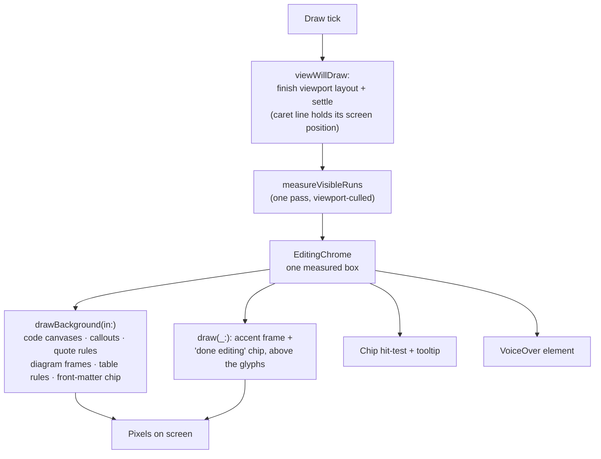

## Editing model (syntax reveal)

Clicking a block activates it: the renderer swaps that block's projection for
its **literal source**, styled but character-for-character 1:1 with the file.
This is the mechanism behind "WYSIWYG that is still just markdown" — you never
leave a rendered surface for a separate raw-text mode, and the caret you place
in the rendered text lands in the exact source byte it visually sits on. The
projection model and the reveal behavior are specified from the user-facing
side in [`editor-modes.md`](../design/editor-modes.md); this section is the
machinery underneath it.

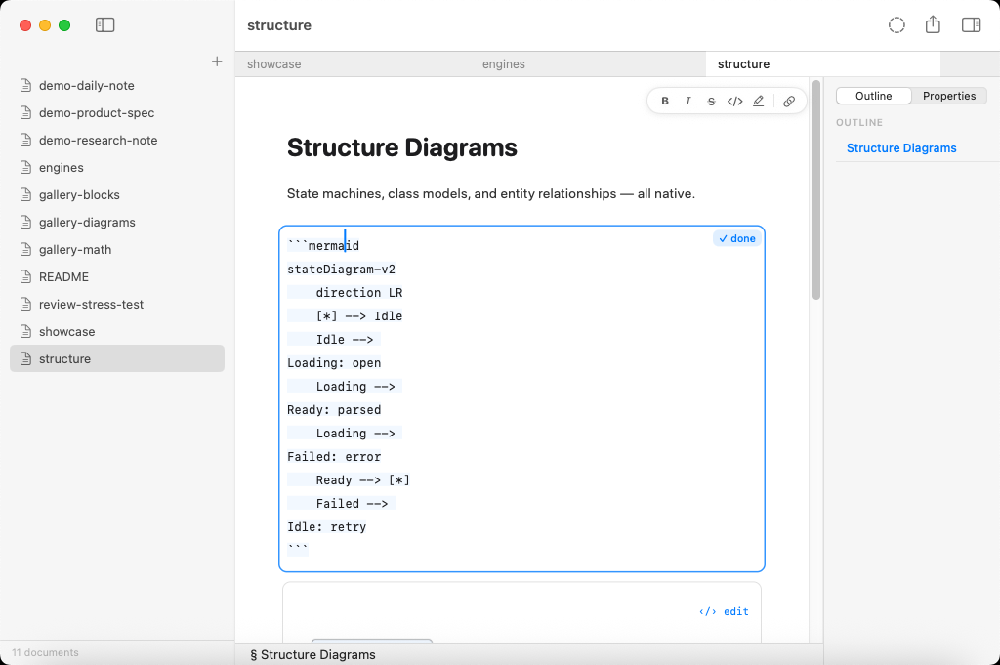

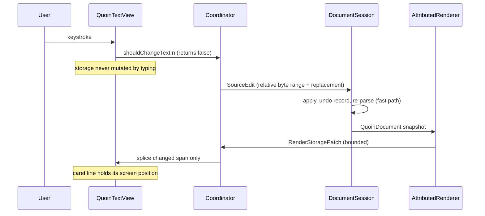

Hidden span delimiters are 1-point clear glyphs — never removed — so a caret
offset in the revealed text *is* a source offset (UTF-16 → UTF-8 mapped at the
edit boundary via `EditMapping`).

- Span delimiters (`**`, `*`, `==`, backticks, link syntax) reveal only when
  the caret is inside the span; structural prefixes (`>`, `- [ ]`) stay
  faded-visible. Caret movement restyles attributes only — the text never
  changes, so selection and the 1:1 mapping survive.
- Keystrokes are intercepted in `shouldChangeTextIn` and become relative
  byte-range edits routed through the session; the storage itself is never
  mutated by typing (always returns `false`).
- Code, tables, TOC, and HTML blocks flip to source on **double-click**;
  diagrams and math open only through explicit intent — the ‹/› edit chip,
  ⌘↩, or the context menu — so a single click (or double-click) can admire or
  select a rendered artifact without turning it into text.
- Smart pairs complete/type-over delimiters; typing a delimiter over a
  selection wraps it; format commands (⌘B etc.) without a selection act on the
  word under the caret.
- **Footnote definitions are read-only** (issue #1). The renderer appends the
  gathered `[^id]:` definitions at the document tail, but it does **not**
  publish their ranges into `RenderedDocument.blockRanges`, so a hit-test in
  that section resolves to no block and activation is a clean no-op — never an
  orphan `activeBlockID`. The definition block has no revealable 1:1 source
  range to offer: consecutive `[^id]:` lines share one cmark paragraph range,
  the block's inlines are re-parsed from the content after the marker, the
  gather re-orders by reference (with zero-length placeholders for
  referenced-but-undefined ids), and the blocks are removed from
  `document.blocks` so `activateBlock`'s top-level lookup can't find them.
  Editing a footnote means editing its `[^id]: …` line in the body flow;
  jump-to-definition and hover peek still work because they key off the
  `footnoteDefinitionID` attribute, not `blockRanges`. `activateBlock` also
  refuses any id absent from `document.blocks` as a belt-and-suspenders guard.

When adding a new inline span type you must touch **both** sides: a renderer
case in `AttributedRenderer` and a styler pass in `MarkdownSourceStyler`, and
register its delimiter in the claimed-ranges ordering (`**` before `*`, links
before emphasis).

### Editing embeds (code, math, diagrams)

Rendered embeds are artifacts, not text, so activating one has extra
machinery — but it obeys the same 1:1-source rule. The full UX spec for this
mechanism, including the flip animation and the live-preview panel, is
[`embed-editing-ux.md`](../design/embed-editing-ux.md):

- **Caret hints carry their coordinate space.** `CaretHint.rendered` and
  `CaretHint.source` are two coordinate spaces for one caret — an embed hint is
  a SOURCE offset (1:1 with the body tag), a prose hint is a RENDERED offset.
  Feeding one through the other's mapping re-ships a caret-lands-early bug, so
  the type makes the space explicit.
- **Typing on a rendered block activates AND replays.** A keystroke on a
  rendered embed flips it to source and replays the keystroke through
  `activateBlock(pendingInsertion:)`, so the character you typed is not lost to
  the mode change.
- **Revealed fragments are `RevealedFragment`** (fragment + editable subrange);
  `editableRange.location` is ALWAYS 0 — the editable source *is* the fragment.
- **The open block's `✓ done` chip + accent frame are the `editingFrame`
  decoration** — drawn ink with its own hit-testing and tooltip, never a text
  run, so the revealed source stays 1:1.
- **Flip-back reverse-maps the caret** so leaving edit mode leaves the caret
  where the source position projects to in the rendered block.

### Live preview and flip motion

The mermaid/math live preview is a **side panel** beside the source, not an
inline run: the last-good render is held while mid-edit source is broken
(`HeldPreview`), and a pure clock-injected decision table paces presentation
(instant on success, a paused badge after ~500 ms of typing-idle, ghost
dissolves). This is [ADR 0004](adr/0004-side-panel-preview.md).

The activation flip animates via `FlipTransitionController` — snapshot-overlay
choreography, delta-keyed, Reduce-Motion-aware, with a 500 ms watchdog. It is
**cosmetic by construction**: real layout applies instantly, so a dropped or
interrupted animation can never leave the document in a wrong state
([ADR 0006](adr/0006-cosmetic-flip.md)). Snapshot-overlay pixels ship as
`NSImageView`-on-`CGImage`-crops (raster-space, upright in any hierarchy)
because no readback API (`CALayer.render(in:)`, a bare CARenderer readout) can
be trusted about orientation — each disagrees with the screen differently; the
fidelity test self-calibrates its readout against an on-screen red/blue anchor.

Keystrokes arriving before the previous edit's projection echoes back are
serialized in `ReaderCoordinator`: they queue and flush one per ack, so a
caret position is never computed against a stale projection.

## The review subsystem (QuoinCore)

Quoin's differentiator: an RDFM/CriticMarkup review loop where suggestions and
comments live **in the `.md` file** and every resolution is one atomic,
byte-safe source edit. Because the annotations are text, an agent or a
collaborator can propose edits by writing the raw file, and you triage them as
rendered cards without either side needing a shared database. The subsystem is
entirely platform-free (QuoinCore), so the app and any future CLI reuse it
unchanged. Design in [`suggestions.md`](../design/suggestions.md).

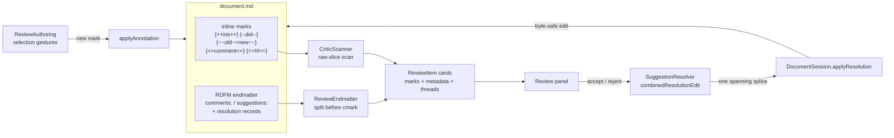

The pieces:

- **`CriticScanner`** — the raw-slice scanner for the five mark kinds
  (`{++ins++}` `{--del--}` `{~~old~>new~~}` `{>>comment<<}` `{==hl==}`) plus
  the optional trailing `{#id}`. Runs on the raw source because cmark mangles
  the delimiters (smart-punct en-dashes `{--`, GFM strikethrough eats
  `{~~…~~}`); code spans and math spans are opaque (marks inside stay literal,
  matching the RDFM normative rule). The dollar-opacity rules mirror
  `MathScanner` byte-for-byte so the two agree on what is math.
- **`ReviewEndmatter`** — the RDFM YAML endmatter (`comments:` /
  `suggestions:` maps + resolution records) sliced off the tail before cmark,
  the same split precedent as front matter. Owns detection (strict,
  CRLF-aware), the shared entry writers (`allocateID`, `appendedEntryEdit`,
  `resolutionRecordEdit`), and byte-lossless emit: writers do line surgery in
  normalized LF and re-apply the block's original line ending
  (`Detected.lineEnding`) so an untouched CRLF sibling is never downgraded.
  `escapedScalar` keeps every written value on one physical line (a raw
  newline would break the strict parser).
- **`SuggestionResolver`** — accept/reject byte semantics + the
  `combinedResolutionEdit` (mark replacement AND the endmatter record as ONE
  spanning splice, so a single ⌘Z restores both) + `resolveAllEdit` (batch as
  one edit). Composes the review-panel `ReviewItem` cards (marks + metadata +
  threads; anchored comments absorb their highlight).
- **`ReviewAuthoring`** — the create-without-editing gestures: every selection
  annotation (comment / replacement / deletion / highlight / insertion) and
  block-adjacent comments for opaque blocks. Validation is self-calibration:
  the candidate is re-parsed and accepted only if exactly the expected mark
  comes back, every prior mark survives, and the block-level structural
  signature is unchanged (an annotation must never change what the document IS
  — it clamps a whole-item selection past the list marker rather than erase
  it).
- **`SuggestTransform`** — Review Mode: a pure, STATELESS keystroke →
  suggestion transform (insertion / deletion / substitution) with coalescing
  by re-scan (a fresh keystroke mints a mark and parks the caret inside; the
  next grows it — no per-keystroke state). Refuses rather than corrupt (a sigil
  that would re-anchor the lazy closer self-calibrates and beeps; a backspace
  never extends across a mark boundary).

### The apply contract (both platforms)

Every review/properties mutation is computed INSIDE `DocumentSession` at apply
time — `applyResolution` / `applyBulkResolution` / `applyAnnotation` /
`applyFrontMatterEdit` / `removeFrontMatterField` — against the session's
current truth, behind the pipeline queue, refusing on drift (an `expectedSlice`
byte check) rather than splicing stale offsets. Computing an edit against a
view projection and applying it later is a corruption class the byte check
closes; the in-actor APIs are the seam a CLI reuses without a view layer.

### Properties (front matter)

`FrontMatterEditing` is the Properties inspector's engine: line surgery over
the leading YAML block, typed-value inference (date / bool / number / flow-list
/ string) that is byte-conservative (a value that does not parse cleanly as its
type stays a string; typed writes preserve the original precision), and
`setTypedFieldEdit` for the typed editors. Like every other mutation, its edits
land through the `DocumentSession` apply contract above.

## Engine seams — math and diagrams

Math and diagrams are **not** Quoin code. Each is a first-party package that
splits a platform-free layout product from an Apple-only render product, and
Quoin owns only the *seam*: it projects its design system onto a small theme
struct, calls one attachment-building entry point, and falls back to a labelled
source card when the engine reports the source unsupported.

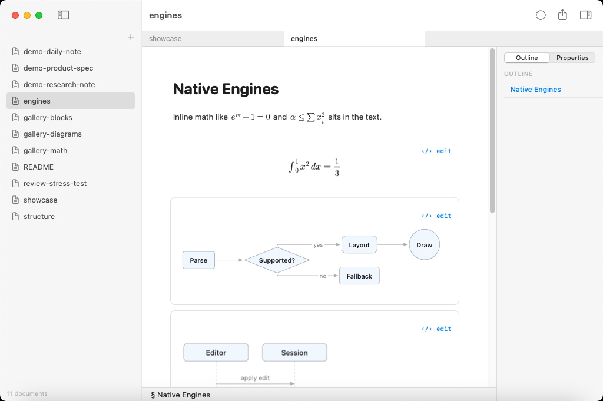

The static shape of the seam is a re-export on one side and a theme-projecting
call on the other — QuoinCore never links the render halves at all:

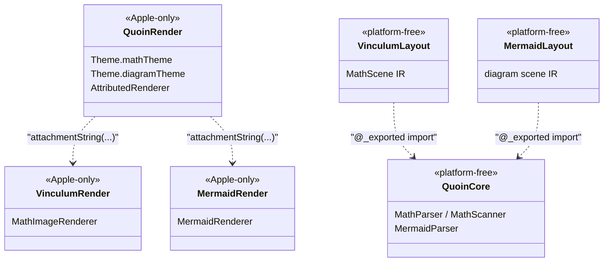

At runtime, one source slice walks through that seam once per render:

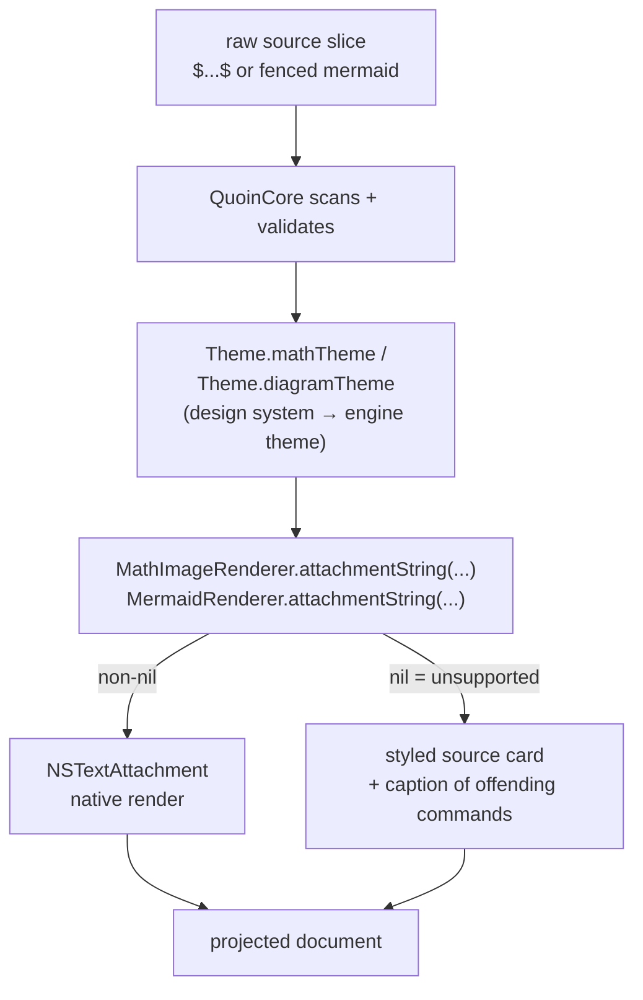

This is [ADR 0003](adr/0003-first-party-engines.md).

### Math (Vinculum)

Math lives in **Vinculum**
([`github.com/2389-research/Vinculum`](https://github.com/2389-research/Vinculum)). It
ships `VinculumLayout` (Foundation-only, builds/tests on Linux — parsing, macros, all
typesetting geometry, the OpenType MATH-table constants, the device-independent
`MathScene` IR) and `VinculumRender` (Apple-only — measuring, drawing via
CoreText/CoreGraphics, the bundled font, the cached `NSTextAttachment`).
QuoinCore `@_exported import`s `VinculumLayout` (`VinculumReexport.swift`), so
`MathParser`, `MathNode`, `MathScanner`, `MathMacros`, `MathAlphabet`, and the
model enums stay reachable through `import QuoinCore` with no per-file import.

Coverage is large — on the order of **400 commands** across 24 `MathNode`
cases: TeX-model atom-class spacing, generalized fractions, accents,
over/under constructs, stretchy delimiters with real MATH-table size variants,
boxes, stateful `\color`, math alphabets, and ~400 symbols. The exhaustive,
current matrix is Vinculum's to own — see its `docs/ARCHITECTURE.md`,
`COVERAGE.md`, and `COMMANDS.md` rather than duplicating a list here that would
only drift. `MathParser.parse` never fails: unknown commands become
`.unsupported` leaves, and `isFullySupported` / `unsupportedCommands(in:)` gate
native rendering vs. the source-card fallback.

**What Quoin owns is the integration, not the typesetting:**

- **Scanning.** `MarkdownConverter` runs `MathScanner` (re-exported) over the
  *raw source slice* — cmark has no math extension and would mangle `$a_b$` —
  recognising `$…$`, `$$…$$`, `\(…\)`, `\[…\]`.
- **Macros.** The `\newcommand` / `\def` pre-pass is host-driven: because
  definitions are document-scoped, `MarkdownConverter` collects them across
  every math segment up front (order-independent) and expands each equation's
  latex before it's stored. The source range is untouched, so byte-lossless
  round-trip and syntax reveal still see the literal source.
- **The theme seam.** `Theme.mathTheme` projects Quoin's design system onto
  Vinculum's `MathTheme` (just ink + `prefersDark`). `AttributedRenderer` calls
  `MathImageRenderer.attachmentString(latex:display:mathTheme:baseSize:)` (from
  VinculumRender); a `nil` return means unsupported and drops to the styled
  source card, whose caption is built from `MathParser.unsupportedCommands`
  naming the offending `\command`s.

Vinculum's own CI tests the parser, layout geometry (headless, via an injected
measurer), and golden renders — not Quoin's. To co-develop, point
`Package.swift` at a local checkout (`.package(path: "../Vinculum")`, don't
commit it) or `swift package edit Vinculum`, then publish, tag, and bump the
version here.

### Diagrams (MermaidKit)

Diagrams live in **MermaidKit**
([`github.com/2389-research/MermaidKit`](https://github.com/2389-research/MermaidKit))
and split the same way: `MermaidLayout` (platform-free parser + layout + scene IR +
geometry linter, Linux-clean) and `MermaidRender` (CoreGraphics/CoreText
drawing behind a `DiagramTheme` seam). QuoinCore `@_exported import`s
`MermaidLayout` (`MermaidReexport.swift`), so `MermaidParser` and friends stay
reachable through `import QuoinCore`. All Mermaid diagram types render natively
(flowchart/graph, sequence, class, state, ER, pie, gantt, journey, …); the
layout internals (Sugiyama layering, dummy-node edge routing, composite-state
recursion) are MermaidKit's to document.

Quoin's side is again just the seam and the fallback: `Theme.diagramTheme`
projects Quoin's design system onto MermaidKit's `DiagramTheme` (ink,
secondary/tertiary text, canvas, accent, hairline, `prefersDark`), and
`AttributedRenderer` calls `MermaidRenderer.attachmentString(source:theme:)`
(from MermaidRender) — an unparseable or unsupported source returns `nil` and
drops to the tidy source card. Diagram-engine changes are tested by MermaidKit's
own CI; co-develop via a local `.package(path:)` or
`swift package edit MermaidKit`, then publish, tag, and bump.

## Platform layering

The engine is built to be reused anywhere Swift compiles; only the view shell
is platform-specific.

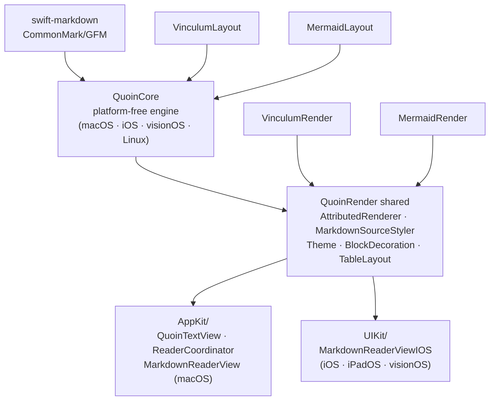

- **`QuoinCore`** imports no UI framework at all (no AppKit/UIKit/SwiftUI) —
  `CGRect` / `CGPoint` / `CGFloat` come from Foundation on Linux and
  CoreGraphics on Apple platforms, guarded by `#if canImport(CoreGraphics)`.
  It builds on macOS, iOS, iPadOS, visionOS, and Linux.
- **`QuoinRender`** splits into shared engine and platform views. The shared
  files — `AttributedRenderer`, `MarkdownSourceStyler`, `Theme`,
  `BlockDecoration`, `QuoinAttributes`, `TableLayout`, `AsyncImageStore`,
  `DocumentExporters` — are guarded `canImport(AppKit) || canImport(UIKit)` and
  branch on `PlatformFont` / `PlatformColor` / `PlatformImage` typealiases, so
  one body compiles on both AppKit and UIKit. The platform view layers live in
  their own subfolders: `AppKit/` holds the macOS `NSTextView` editor
  (`QuoinTextView`, `ReaderCoordinator`, `MarkdownReaderView`); `UIKit/` holds
  the iOS/iPadOS/visionOS reader (`MarkdownReaderViewIOS`). Each is gated so it
  simply compiles out on the other platform.

The macOS editor is *not* a separate SwiftPM target on purpose: it depends on
module-internal render helpers (`QuoinTextView.invalidateDecorations`,
`MarkdownSourceStyler`, the decoration-drawing internals), and hoisting it
across a target boundary would force that surface public — weakening
encapsulation instead of strengthening it. The `#if` gate already gives clean
per-platform compilation with everything kept internal.

Mac Catalyst is not supported: on Catalyst `canImport(AppKit)` is true, so the
AppKit guards select the AppKit branch inside a UIKit runtime and fail to
compile. Supporting it means changing those guards to
`canImport(AppKit) && !targetEnvironment(macCatalyst)` throughout.

## Concurrency and the Swift 6 language mode

The threading model is deliberately small: **one actor for the document, one
main actor for everything the user sees.**

- `DocumentSession` is a `public actor`. It owns the source string, the AST,
  the undo stacks, and autosave; every mutation is serialized on its executor.
- `ReaderModel`, `LibraryModel`, and `OpenDocumentStore` are
  `@MainActor` (`ReaderModel`/`LibraryModel` are also `@Observable`). All view
  state, caret bookkeeping, and the reveal projection live on the main actor.
- Edits flow through a **serialized FIFO** on the main actor
  (`ReaderModel.editPipelineTask`): each keystroke/command chains off the prior
  task's completion, hops onto the session actor to apply, then adopts the
  result back on the main actor. Undo/redo and resolutions join the same FIFO so
  they can never interleave with an in-flight edit (see the apply contract and
  invariant 8).

**Language mode by target.** `QuoinCore`, the **macOS app target** (`Quoin`),
and its **`QuoinUITests`** bundle build under the **Swift 6 language mode**;
`swift build`/`swift test`/`xcodebuild` all run clean with strict concurrency
checking. `QuoinRender` (and its `QuoinRenderTests`) stay in **Swift 5 language
mode**: the remaining Swift 6 diagnostics there are all `sending self` in the
caret/viewport settle-and-pin `DispatchQueue.main.async` closures — the
`QuoinTextView` machinery that enforces the viewport invariant — and that
migration is staged behind the reveal/caret characterization tests rather than
rushed. The app target compiles against `QuoinRender` regardless, because
language mode is per-module. The iOS app shell (`QuoinIOS`) remains Swift 5 for
now (iOS is a later platform); it builds against the same Swift-6 `QuoinCore`.

**How the app target satisfies strict concurrency (no isolation weakened):**

- **Off-main full render.** `ReaderModel.buildAsyncRender` is a `nonisolated`
  async method; the caches enter as `sending` and the finished projection
  returns as a `sending` value, so the compiler proves the single-owner handoff
  the off-main render (issue #33) always relied on. No `@unchecked Sendable` or
  `nonisolated(unsafe)` is used to carry the non-Sendable `NSAttributedString`
  across the boundary — it is a genuine region transfer. `AttributedRenderer`
  is a `Sendable` value type (all-Sendable stored state), so a copy crosses to
  the background executor freely.
- **FSEvents.** `FSEventsWatcher.onChange` is `@Sendable`; `LibraryModel`
  supplies a closure that hops back with `MainActor.assumeIsolated` (the stream
  is dispatched on `DispatchQueue.main`, so the assumption is checked and
  correct). The watcher is never sent across an actor, so it needs no `Sendable`
  conformance itself.
- **Library scan.** `LibraryModel.rescan` runs the pure `Library.scan` in a
  `Task.detached` (a Sendable `URL` in, a Sendable `LibraryNode` out) while the
  owning task stays on the main actor to adopt the tree — coalesced so at most
  one scan runs at a time.
- **Termination.** `applicationShouldTerminate` flushes sessions on a *detached*
  task (a main-actor task is not guaranteed to run in the `.terminateLater`
  runloop mode) and answers exactly once through a `@MainActor`
  `TerminationReplyBox`, which also avoids capturing the non-Sendable
  `NSApplication` in the detached closure.
- **App delegate.** `AppDelegate` is `@MainActor`, which isolates its
  `pendingDeepLink` slot instead of leaving it as nonisolated global mutable
  state.

## Accessibility in the SwiftUI chrome

The app shells (`App/macOS`, `App/iOS`) honor three system settings; the
document body's *scaling* is out of scope for these (it has its own reading
zoom, `Theme.textScale`), but its *structure* is exposed to VoiceOver — see
"VoiceOver structure in the document body" below.

- **Dynamic Type.** The handoff pins the type ramp as *final* (exact point
  sizes), so the chrome must scale with the "Larger text" setting **without**
  discarding that ramp. Every `.font(.system(size:))` chrome site therefore
  goes through `.quoinScaledFont(size:weight:design:)` (`ScaledChromeFont`
  in QuoinRender), a `@ScaledMetric(relativeTo: .body)` wrapper that multiplies
  the design's base size by the Dynamic Type factor. One shared reference style
  (`.body`) means the whole ramp grows by one curve and keeps its proportions —
  do **not** hand-swap sites to semantic styles like `.body`/`.caption`.
  When you add new chrome, use `quoinScaledFont`, not a raw `.system(size:)`.
  The two fixed-height, `.clipped()` strips — the status bar (`ReaderScreen`)
  and the document tab bar (`DocumentTabBar`) — would guillotine their scaled
  text, so their heights are `@ScaledMetric` too (`statusBarHeight`,
  `barHeight`) and grow with the label.
- **Reduce Motion** gates the sidebar/outline reveals and the format pill on
  `accessibilityReduceMotion` (the flip controller was already aware).
- **Reduce Transparency** gives Quick Open and the find/replace bars an opaque
  `windowBackgroundColor` fallback.

### Keyboard navigation of the chrome (issue #11)

The pointer-free navigation surfaces keep their movement math in small pure
enums in QuoinCore (platform-free, Linux-testable) so the wrap/skip/edge rules
are pinned once instead of re-derived in SwiftUI:

- **`ListSelection`** — arrow-key highlight movement for the result lists.
  Quick Open (`QuickOpenPanel`) and the sidebar library search
  (`LibrarySidebar.searchResults`) both feed keypresses through it: ↑/↓ wrap
  around the ends, Home/End jump, `clamped` folds a stale highlight back into
  range when an async query result replaces the list. The SwiftUI views own the
  highlight as a plain `Int`; the view renders a visible accent selection and
  Return opens it / Escape dismisses. Covered by `ListSelectionTests`.
- **`OutlineKeyboard`** — the outline tree's keyboard cursor. Given the flat
  `[HeadingInfo]` outline and the shared `collapsed` set, it maps ↑/↓/←/→ to a
  `Response` (`move`/`collapse`/`expand`/`none`) using `OutlineCollapse`'s
  visible-rows and positional-ancestor helpers (`parents(outline:)` is now
  shared with the panel's chevron rendering). `OutlinePanel` owns a `focused`
  cursor distinct from the reading-position `highlightID` (#37/#R3) and applies
  the response; **collapse state is still mutated ONLY by explicit user action**
  (chevron click or ←/→), so #74's manual-collapse-sticks rule is intact — the
  reading follow never expands a branch. The chevron carries VoiceOver
  disclosure semantics (`accessibilityValue` expanded/collapsed). Covered by
  `OutlineKeyboardTests`. *Deferred (needs a running UI to verify):* the exact
  focus-order handoff between the panel's `.focusable` container and the
  per-row buttons under Full Keyboard Access — the movement logic is tested, but
  which control first receives an arrow key is a live-focus behavior, not a pure
  function.

### VoiceOver structure in the document body

The whole document renders into one `QuoinTextView` (`NSTextView`), so VoiceOver
sees a single text field by default. A bounded structure pass (issue #10) makes
the projection legible to assistive technologies:

- **`BlockAccessibility`** (QuoinRender, platform-free, no AppKit) is the ONE
  place that maps a `BlockKind` to a spoken announcement — *"Heading level 2,
  Introduction"*, *"Code block, swift, 12 lines"*, *"Table, 3 columns, 4
  rows"*, *"Note callout"*, *"Ordered list, 2 items"* — and extracts a
  heading's level. It is pure so the wording is unit-tested directly
  (`BlockAccessibilityTests`). `AttributedRenderer.render(block:)` is the one
  call site: it stamps each block's announcement onto the block's rendered
  range, so full and incremental (patch) renders tag identically and the labels
  can't drift.
- **Two rotors, one scan.** `render(block:)` tags a heading's range with
  `QuoinAttribute.headingLevel` (an `NSNumber`) and every *other* structural
  block's range with `QuoinAttribute.blockAccessibilityLabel` (its announcement
  string) — both layout-inert marker attributes.
  `QuoinTextView.accessibilityCustomRotors()` scans those runs and vends two
  `NSAccessibilityCustomRotor`s whose item results carry a `targetRange` + a
  `BlockAccessibility` label:
  - **Headings** (`.heading`) — jump caret-to-heading (VO-U).
  - **Landmarks** — flick through the non-heading structural blocks (code,
    table, list, callout, quote, diagram, math, TOC, front matter, separator,
    HTML), hearing WHAT each region is. This is the surface that makes the
    block-kind announcements reach assistive technology.

  The search delegates are retained by the view (the rotors hold them weakly)
  and answer next/previous through the pure `StructureRotor.result` navigator
  (strict `>`/`<` anchoring, first/last on the nil-current first search,
  case-insensitive substring filtering) — unit-tested in `StructureRotorTests`.
  The scan is cached and only re-runs when the text storage actually changes
  (observed via `NSTextStorage.didProcessEditingNotification`), so VoiceOver's
  per-keystroke queries don't each re-`enumerateAttribute` the whole document.
  A title-less heading (legal markdown, listed in the outline) renders as a lone
  zero-width space so it still has a navigable, taggable position and does not
  vanish from the Headings rotor.
- **Attachment labels.** Math and diagram embeds are `NSTextAttachment` images.
  The engines already stamp `image.accessibilityDescription` with spoken math
  (Vinculum) / diagram narration (MermaidKit); the renderer surfaces those —
  `MermaidRenderer.altText(source:)` and `MathImageRenderer.rendered(…)
  .spokenDescription` — through `BlockAccessibility.diagramLabel` /
  `equationLabel`, applied as an **idempotent overwrite** (never read-then-append:
  Vinculum vends its shared cached `NSImage`, so re-prefixing would accumulate
  "Equation, Equation, …" and mutate a value other threads read). The math path
  reuses Vinculum's shared render cache; the diagram narration re-parses the
  Mermaid source independently of the render cache (a bounded, per-block,
  human-paced parse — MermaidKit exposes no combined render+narration accessor,
  and the engine is out of scope for this repo).
- The `✓ done` chip is a pressable `NSAccessibilityElement` child of the view
  (pre-existing; editor-modes plan Phase 2.3).

Deferred (stated so the boundary is explicit): per-*element* rotors that step
individual tables / links / tasks (as opposed to the block-level Landmarks
rotor), accessibility containers grouping sidebar / outline / find bar, and
alternate actions on hover-only controls (tab close, copy-code).

## Native integration surface (macOS shell)

The macOS shell wires Quoin into the system the way a native editor is expected
to — Finder document types (Open With, `Reveal in Finder`), a dock-recents
menu, and, added for #31, a `quoin://` URL scheme plus sidebar drag-out. The
sandbox makes both of the #31 surfaces a security-boundary question, so the
enforcement is split deliberately: the *decidable, testable* logic lives in
`QuoinCore`; the shell only holds the plumbing.

- **Onboarding & Help surfaces (#13).** First-run sample content and the Help
  menu follow the "editor teaches the product" approach: every guide is a real,
  editable `.md`, never a modal wall of text. The curated markdown ships as
  **bundled resource files** under `App/macOS/Resources/` (`WelcomeToQuoin.md`,
  `MarkdownGuide.md`, `QuoinExtensions.md`, `KeyboardShortcuts.md`,
  `PrivacyAndFiles.md`, `ExportGuide.md`) — never string literals in code, so
  writers can edit teaching content without touching Swift and the docs stay
  round-trippable markdown. All the *decisions* about those files live in the
  pure, platform-free `LibrarySeeding` seam (QuoinCore): the `helpSet` (every
  Help entry, in menu order) and `sampleSet` (the first-run pair), plus
  `shouldOfferSeed(existingFileNames:)` and `documentsToPlace(existingFileNames:)`
  — the latter enforces *never overwrite a same-named file*. The seam is
  unit-tested on Linux CI (`LibrarySeedingTests`), and `GuideConformanceTests`
  pins that every `helpSet`/`sampleSet` resource actually exists and parses
  losslessly, so a Help route can't drift from a missing file. The macOS shell
  is a thin adapter: `QuoinApp`'s Help `CommandGroup` iterates `helpSet` and
  posts `openBundledDocumentNotification` (carrying `resource`/`filename`);
  `LibraryModel.materializeBundledDocument` copies the resource into the library
  (or, with no library open, a writable *Quoin Guides* folder in Application
  Support, so Help is never a dead click) and returns its URL, skipping any file
  already present. The first-run offer is opt-in and non-modal — a dismissible
  card in the empty state, shown only after the user actually picks a folder
  (`chooseLibraryFolder` now reports whether it adopted one) that
  `shouldOfferSampleDocuments` finds unseeded; `seedSampleDocuments` places the
  pair and opens the Welcome note. Everything is local-only by construction:
  bundled files and filesystem names, no network, account, or telemetry.
- **Document types & coexistence (#16).** The `CFBundleDocumentTypes` array
  (generated from `App/macOS/project.yml`) declares Quoin's stance for two
  Uniform Type Identifiers, chosen so Quoin reads as a *real editor* without
  being a *bully*:
    - **`net.daringfireball.markdown` — `Editor`, rank `Alternate`.** Quoin is a
      genuine Markdown editor, so it claims the `Editor` role (it appears in
      *Open With* and can be set as the default `.md` app). But the handler rank
      stays `Alternate`, never `Owner`: Quoin does **not** aggressively seize
      `.md` from whatever the user has already chosen (Typora, VS Code, iA
      Writer, BBEdit…). Double-clicking a `.md` file opens it in whatever the
      user set as default; Quoin is always one *Open With* away, and becomes the
      default only if the user explicitly picks it. Quoin *imports* (does not
      *own*) the Markdown UTI (`UTImportedTypeDeclarations`, conforming to
      `public.plain-text`, extensions `md`/`markdown`/`mdown`/`mkd`) so the type
      resolves even on a system where no other app declares it.
    - **`public.plain-text` — `Viewer`, rank `Alternate`.** Quoin can open a
      `.txt` handed to it via *Open With*, but declares only the `Viewer` role
      and never claims ownership of plain text — it exerts no default-app
      pressure on `.txt`. (The macOS panels still gate on it: File ▸ Open… and
      the Services save panel allow `net.daringfireball.markdown` + plain text.)

  Every open path — Finder double-click / *Open With*, File ▸ Open… (⌘O),
  sidebar click, quick open, a `.md` dropped on the editor, Open Recent, and the
  dock-recents menu — funnels through the one `MainWindow.open(_:)` (a real tab
  + `OpenDocumentStore` session), never a detached one-off window. Delivery from
  `AppDelegate.application(_:open:)` uses the same **slot** pattern as deep links
  and Services seeds: the URL is appended to `AppDelegate.pendingOpenURLs` and an
  `openDocumentNotification` fires, but a *cold* launch (the open arrives before
  any window's observer is subscribed) is still honored because the first
  window's `onAppear` drains the slot; a backgrounded-but-running app drains it
  when a window becomes key. Draining is atomic (grab-then-clear) so a dropped
  notification never loses an open and two windows can't race to open a file
  twice — this replaces an earlier fixed-delay guess in the dock handler.

  Open Recent's list rules are the pure, no-I/O `RecentDocuments` seam in
  `QuoinCore`: `recording(_:into:limit:)` is the most-recently-used update
  (front-insert, de-duplicate, cap at 20) and `present(in:limit:exists:)` prunes
  to files that still exist (so a deleted recent never shows in a menu or reopens
  to a dead path) — `exists` is injected so both are unit-tested off the
  filesystem (`RecentDocumentsTests`). The shell only persists the array
  (`UserDefaults`, key `RecentDocuments.defaultsKey`) and mirrors it to
  `NSDocumentController.noteNewRecentDocumentURL`; the same list feeds the File ▸
  Open Recent menu (10 entries), the dock menu (5), and quick open's empty-query
  list (8).

- **`quoin://` deep links.** The scheme is declared in the app's Info.plist
  (`CFBundleURLTypes`, generated from `App/macOS/project.yml`), which is what
  makes LaunchServices deliver `quoin://` URLs through
  `AppDelegate.application(_:open:)` alongside plain `file://` opens. That
  method branches on `QuoinURLScheme.isDeepLink`, parses with
  `QuoinURLScheme.parse`, stashes the result in `AppDelegate.pendingDeepLink`,
  and posts `openDeepLinkNotification`. The key `MainWindow` drains the slot
  (`consumePendingDeepLink`) — a slot rather than notification `userInfo` so a
  *cold* launch, where the URL arrives before any window's observer exists, can
  still drain it from the first window's `onAppear`.

  Confinement is layered. `QuoinURLScheme.resolvedPath(forRawPath:relativeTo:)`
  is a **pure, no-I/O** resolver: it collapses `.`/`..` lexically and refuses
  any result that is not strictly under `root + "/"`, so traversal
  (`../../etc/passwd`), absolute paths elsewhere, and root-name-prefix
  collisions (`/LibraryOther` vs `/Library`) are rejected by string math alone.
  The window then requires the file to exist and be markdown, and opens it
  through the library's already-active security scope — the app holds *no*
  sandbox access outside the granted root, so an out-of-library link fails even
  if the lexical check were somehow bypassed. A malformed or out-of-scope link
  beeps; it never guesses. The pure logic is exercised by
  `QuoinURLSchemeTests` (traversal, NUL bytes, prefix collisions, encoding).

  Residual, by design: a symlink *planted inside* the library that points
  outside passes the lexical check, but the sandbox evaluates the resolved
  target and denies the read — and planting it already requires write access to
  the user's own library. Multi-library windows resolve a link only against the
  key window's current root.

- **Drag-out to Finder / other apps.** `documentDragProvider(for:isDirectory:)`
  (LibrarySidebar) backs every sidebar `.onDrag`. It vends `public.file-url`
  (via `NSURL`) — unchanged, so the intra-sidebar move drop
  (`performLibraryDrop`, keyed on `public.file-url`) is unaffected — *and*, for
  leaf files, a `registerFileRepresentation` of the file's real content type so a
  drag OUT lands as a genuine file copy in Finder or an attachment elsewhere.
  It registers `coordinated: true`: the item provider reads the existing file
  with file coordination and must never move or delete the original, so a
  drag-out can never remove a document from the library. The destination
  process receives its read access through the drag pasteboard's own sandbox
  extension — no new entitlement is needed.

- **Drop feedback and operation semantics (#9).** The pure decision — given a
  dragged item and a proposed target, what is valid (move / copy / reject) —
  lives in `DropValidation` (QuoinCore), the testable seam (`DropValidationTests`
  covers self-drop, descendant-drop, no-op same-folder, sibling move, and
  non-Markdown external rejection). Everything AppKit-side is thin. Sidebar
  drops go through `LibraryDropDelegate` (a `@MainActor DropDelegate`): its
  `dropUpdated` returns a `DropProposal` whose operation (`.move` / `.copy` /
  `.forbidden`) drives the drag badge and a highlight (accent when accepted, red
  when forbidden). Because an `NSItemProvider` only yields its URL
  asynchronously — too late for the live badge — the delegate reads the dragged
  file URL **synchronously off the live drag pasteboard**
  (`NSPasteboard(name: .drag).readObjects(...)`) during `validateDrop` /
  `dropUpdated`, which is reliable while a drag is in flight. That read drives
  the badge/highlight only; the actual file op runs in
  `performLibraryDrop`, which loads the URL from the drop's own
  `itemProviders` and **re-runs `DropValidation` against the real dropped URL**,
  so a badge computed from a pasteboard read can never move the wrong file. Internal items MOVE (undoable via the
  `moveUndoStack`); external Markdown files import as a COPY; invalid targets are
  rejected (a beep when a rejected URL actually lands, though `.forbidden`
  usually makes the system refuse the drop before `performDrop`). Editor drops
  (ReaderScreen) route through `DropValidation.editorDrop`: images copy into
  `assets/` (`ReaderModel.insertImage`, failures surfaced as a non-modal
  banner), `.md` files open as a tab, and anything else is rejected with
  `ReaderModel.reportUnsupportedDrop` (beep + banner) instead of a silent
  no-op. `DropValidation.imageExtensions` is the canonical image-type set
  (`ReaderModel.imageExtensions` aliases it).

- **Services provider — New Quoin Document with Selection (#35).** The
  `NSServices` array in the app's Info.plist (generated from
  `App/macOS/project.yml`) declares the menu item, the `NSMessage` selector, and
  the `NSSendTypes` (text) that gate the item to appear only when the sender
  offers a string. `applicationDidFinishLaunching` sets
  `NSApp.servicesProvider = self`, so macOS routes the message to
  `AppDelegate.newDocumentWithSelection(_:userData:error:)`. Registering a
  *provider* is orthogonal to Quoin's existing role as a services *requestor*
  (NSTextView's built-in Services support is untouched).

  The handler is deliberately thin: it pulls `.string` off the pasteboard,
  refuses an empty selection (writing the `error` out-parameter), and otherwise
  builds a `NewDocumentSeed` — the **pure, platform-free** naming/content seam in
  `QuoinCore`. `NewDocumentSeed.make(fromSelection:)` normalizes newlines, gives
  the body a single trailing newline, and derives a tidy filename from the first
  non-empty line (dropping a leading heading run or list marker, capping the
  title length on grapheme boundaries, and deferring to `FilenamePolicy` for the
  hard filesystem rules + the "Untitled" fallback). That seam is unit-tested by
  `NewDocumentSeedTests`; the pasteboard glue above it needs a live
  `NSPasteboard` and so is not headlessly testable — it is kept trivial for that
  reason.

  Delivery reuses the deep-link handshake exactly: the seed is stashed in
  `AppDelegate.pendingSelectionSeed` (a slot, not notification `userInfo`, so a
  cold launch can still drain it from the first window's `onAppear`), the app
  activates, and `newDocumentWithSelectionNotification` fires. The key
  `MainWindow` drains it (`consumePendingSelectionSeed`): with a library it calls
  `LibraryModel.createDocument(baseName:content:)`, writing into the folder Quoin
  already holds security scope on — **no new entitlement**. With no library,
  `createDocument` returns nil and the window falls back to a powerbox
  `NSSavePanel` (`saveSelectionViaPanel`), whose grant makes the write + open
  legal under the existing user-selected read-write entitlement.

- **Handoff / current activity (#36).** The active document is published as an
  `NSUserActivity` of type `ai.2389.Quoin.editing` (declared in
  `NSUserActivityTypes`, generated from `project.yml`). The payload split
  mirrors the deep-link one: the *decidable* part is pure and lives in
  `QuoinCore`. `QuoinURLScheme.deepLink(forDocumentPath:relativeTo:)` is the
  **no-I/O inverse** of `resolvedPath` — it builds a `quoin://open?path=…` link
  whose `path` is *relative* to the library root (portable across machines whose
  library sits at a different absolute location), and returns `nil` when the
  document is not strictly under the root, so a document outside a granted
  library publishes **no activity**. The link — never an absolute path or a
  security-scoped bookmark — rides in `userInfo[QuoinURLScheme.activityDeepLinkKey]`.
  `MainWindow.updateUserActivity()` publishes only from the KEY window (so a
  background window's document isn't mistaken for the one in front), reusing one
  activity object across tab switches and resigning it when the window is not
  key or has no linkable document; `onDisappear` invalidates it. Resume comes
  back through `AppDelegate.application(_:continue:restorationHandler:)`, which
  parses the link and routes it through the *same* `pendingDeepLink` slot +
  `openDeepLinkNotification` path as `application(_:open:)` — so all the
  confinement above (lexical resolve, existence + markdown check, live security
  scope) applies unchanged on the receiving side. The pure build/round-trip
  logic is exercised by `QuoinURLSchemeTests`. macOS-only today; it becomes
  real cross-device Handoff once an iOS/iPadOS reader ships. Spotlight indexing
  (#6) is deliberately not claimed here (`isEligibleForSearch = false`).

- **Window & session restoration (#15).** Quit, relaunch, restart, or crash and
  each window comes back to the library, tabs, active document, panel layout,
  and scroll position it had. This is implemented **around** the existing
  `WindowGroup`/`MainWindow`/`LibraryModel` shell — the `NSDocument`/`DocumentGroup`
  migration the TRD imagines is **intentionally DEFERRED** (it is a shell rewrite
  that also governs the future iOS shell, and `OpenDocumentStore` + Quoin's own
  document tabs already deliver what a `DocumentGroup` would; see
  [ADR 0009](adr/0009-restoration-around-windowgroup-not-nsdocument.md) and
  ADR 0005).

  The split follows the same discipline as the surfaces above: the *decidable,
  testable* part is pure and lives in `QuoinCore` (`WindowSessionState`), and the
  shell holds only the plumbing. `WindowSessionState` is a `Codable` model of one
  window's session — open tabs, active tab, sidebar/inspector visibility + mode,
  and per-tab scroll anchor — with its own serialize/deserialize
  (`serialized()` / `init?(serialized:)`, version-gated so a downgrade refuses a
  future blob), a `capture(...)` that folds live state into it, and a
  `restoredTabs(rootPath:exists:)` that re-hydrates it. `MainWindow` only mirrors
  it into `@SceneStorage("QuoinWindowSession")` (per SwiftUI scene → naturally
  per window) and rebuilds tabs/panels from it; `ReaderScreen` seeds its
  inspector chrome + restore scroll from the window and reports live changes back
  up. `WindowSessionStateTests` covers round-trip (every field), pruning,
  the no-absolute-path-leak assertion, and the dedupe decision.

  **Only relative handles are persisted.** Each tab is stored as a
  library-root-relative path (`QuoinURLScheme.relativePath` — the exact inverse
  of the deep-link resolver), **never** an absolute path and **never** a raw
  security-scoped bookmark. A one-off file opened from *outside* the library
  (⌘O) has no sandbox-safe handle, so it is simply not persisted. The library
  bookmark itself lives where it already did — the per-folder bookmark store
  keyed by the window root (#61) — and the window root path in
  `@SceneStorage("QuoinWindowRoot")` is that store's key, not a document handle.
  On restore, `restoredTabs` resolves each relative handle back through the same
  lexical confinement a `quoin://` link uses (`resolvedPath`), so a handle that
  climbs out of the root (`../…`) is refused; it prunes tabs whose files moved,
  were renamed, or vanished (`exists` is injected, so this is unit-tested off
  disk); and it dedupes two handles that name one file to a single tab.

  **Route to the existing session, never a second writer.** Opening a file that
  is already open (Finder, Spotlight, a library click, two path forms) must land
  on the existing tab/window/session — two `DocumentSession`s over one file is
  the ledger-#12 dual-autosaver corruption. Live routing uses
  `OpenDocumentStore.sameFile` (filesystem-accurate: symlinks resolved, case
  folded on the case-insensitive default volume); the *lexical* half of that
  rule is captured purely as `SessionRouting` (normalize + case-fold →
  `focusExisting`/`openNew`) so the decision is unit-tested, and `restoredTabs`
  uses `SessionRouting.canonicalKey` to collapse duplicate restored handles. One
  session per file across every window and tab is `OpenDocumentStore`'s
  ref-counting invariant (ADR 0005), unchanged.

  **Dirty documents & crash (autosave contract).** There is *no* separate
  autosave journal — the file on disk **is** the durable state, and restoration
  reopens it through `DocumentSession.open`. Exposure is bounded by leaning on
  existing machinery: autosave-in-place is 400ms-debounced; a graceful quit
  (⌘Q, logout, restart) drains **every** live session through
  `applicationShouldTerminate`'s detached flush (with a 3s watchdog) *before* the
  process dies, so an in-flight edit is written, not lost; `saveNow` writes
  atomically, so a file is never half-written even on a hard kill. The only
  window where keystrokes can be lost is a true hard crash (power loss / SIGKILL)
  inside the sub-400ms debounce — and even then the byte-lossless, atomic write
  means the document on relaunch is the last *consistent* save, never a corrupt
  merge. If the file changed underneath a session (another writer, a sync
  daemon), the file-coordination reload path surfaces the **merge banner**
  ("changed on disk while you had unsaved edits" → *Keep Mine* / *Use Disk
  Version*) rather than clobbering silently — so what was recovered vs. replaced
  is always shown, never ambiguous. None of this weakens byte-losslessness.

- **Core Spotlight indexing (#6).** So system search finds Quoin documents,
  headings, front-matter tags, and body snippets, the app maintains a **private,
  on-device** Core Spotlight index. The split follows the same discipline: the
  *decidable, testable* part is pure and lives in `QuoinCore`
  (`SpotlightIndexing`), and the framework glue is a thin, macOS-only file
  (`App/macOS/Sources/SpotlightIndexer.swift`) behind `canImport(CoreSpotlight)`.

  `SpotlightIndexing` derives everything device-independent from a parsed
  `QuoinDocument`: the **title** (front-matter `title` → first heading →
  filename stem), the **heading list**, front-matter **keywords** (scalars and
  split array/list tokens, deduped), and a **grapheme-safe snippet** + fuller
  body text (front matter, review endmatter, the `[TOC]` marker, and raw HTML
  excluded). The **stable identifier is the document's root-scoped ABSOLUTE
  path** (with the library-relative path kept alongside as the display
  subtitle). Absolute — not relative — because `CSSearchableIndex.default()` is
  a *single, app-wide* index while each window owns its own `LibraryModel` and
  may hold a different root (multi-folder windows, #61): a bare relative id
  (`Notes/Today.md`) would **collide** across libraries, so two roots each
  containing that path would overwrite each other's item, delete each other's
  item, and open the wrong file on tap. The absolute path is unique across
  libraries (a path lives under exactly one root). Containment is validated by
  the same check the deep link uses (`deepLink(forDocumentPath:relativeTo:)`)
  and the id round-trips back through `resolvedPath`, so a tapped result reuses
  the deep-link open path with no parallel opener. `SpotlightIndexingTests`
  covers title/heading/keyword derivation, snippet truncation on grapheme
  boundaries, the identifier round-trip, cross-library uniqueness, its refusal
  of out-of-root paths, the stale-set diff, and the persisted-root registry.

  `SpotlightIndexer` reconciles after every `LibraryModel` scan (so FSEvents
  changes flow through it). Reconciliation is **incremental and idempotent**: a
  per-root identifier→modification-date map (persisted in `UserDefaults`, so the
  diff survives launches) lets an unchanged file skip its re-read/parse; changed
  files are re-indexed; and documents that moved or disappeared are **deleted**
  from the index (`staleIdentifiers` diffs the previous set against the current
  scan — no orphans). The per-root blobs are bounded by an **LRU registry**
  (`SpotlightIndexing.prunedRootRegistry`, cap 32) so folders opened once long
  ago don't accumulate `UserDefaults` entries forever — there is no
  library-removed signal to prune on, so recency is the bound; an evicted root
  simply re-indexes fresh next time it's opened. The heavy walk/parse runs in a
  detached task; only the `CSSearchableIndex.default()` calls and the Sendable
  result cross back to the main actor. Only `.md` is indexed, matching the
  deep-link open path's `.md`-only rule so every indexed item is openable. A
  Spotlight tap arrives via `application(_:continue:)` as a
  `CSSearchableItemActionType` activity carrying the item's identifier under
  `CSSearchableItemActivityIdentifier`; the handler rebuilds a **root-confined**
  `quoin://` deep link (`QuoinURLScheme.spotlightDeepLink`) and routes it through
  the **same** `pendingDeepLink` slot + confinement (lexical resolve, existence +
  markdown check, live security scope) as every other open. Because the id is
  absolute and the link is `confinedToContainingRoot`, only the window whose
  library *owns* the path honors it (others leave the slot rather than beeping or
  opening a same-named sibling) — so a tap opens the exact document the result
  described, even across multiple libraries.

  **Privacy.** This is Quoin's private index only — nothing is marked for public
  or server-side indexing, and the app makes **no network request** for it. The
  derived text never leaves the device; it lives in the OS's per-app Spotlight
  store and is removed when a document leaves the library (or the app is
  uninstalled). No new entitlement is required for an app's own private index.
- **App Intents / App Shortcuts (#7).** Quoin surfaces five actions to
  Shortcuts, Spotlight, and Siri — Create Note, Append Text to Note, Open Note,
  Search Library, Export Note — compiled *into* the main app (no separate
  extension target). The same split as above holds: the *decidable* logic is
  pure and in `QuoinCore`, the `@available(macOS 14)` / `canImport(AppIntents)`
  structs in `App/macOS/Sources/Intents/` are a thin shell.

  Two pure seams do the work. `LibraryQuery` (QuoinCore) resolves documents
  against a `Library.scan` tree — the SAME index the sidebar and quick open use,
  never a second discovery path: it flattens the tree to refs keyed by their
  *root-relative path* (the entity identity, portable exactly like a `quoin://`
  link's `path`), resolves ids back to refs, and ranks free-text queries
  (exact filename/path → title equality → the shared `QuickOpen.fuzzyScore`).
  `DocumentAppend.appendEdit(appending:to:)` builds the byte-precise append as a
  length-0 insertion at `source.utf8.count` — every existing byte untouched, so
  the round-trip invariant holds for the whole prefix for free; it normalizes
  the caller's newlines, collapses their trailing newlines to exactly one, and
  inserts a joining `\n` only when the source doesn't already end in one. Both
  seams are unit-tested (`LibraryQueryTests`, `DocumentAppendTests`) on Linux CI
  included; `DocumentSession.appendText` (the in-actor apply, the
  `applyResolution` pattern) is covered by `DocumentSessionAppendTests`.

  **No mutating intent ever writes raw bytes.** Create routes through a
  `DocumentSession` (atomic, file-coordinated `writeAtomic`) into a
  `Library.uniqueURL` collision-free name; Append opens a `DocumentSession` on
  the target and calls `appendText`, which computes the edit IN-ACTOR against
  the session's current source and applies it through the same `applyEdit`
  pipeline as a keystroke — re-parse, publish, undoable, byte-lossless. An
  append landing on a file that is open in a live window is just an external
  write to that session: its watcher/presenter raises the standard reload (clean)
  or merge banner (dirty), never silent loss.

  The shell (`IntentLibraryAccess`, `@MainActor`) is what makes an intent work
  while Quoin is backgrounded or not running: it resolves the most-recent
  library's *app-scoped security bookmark* (the SAME `quoin.library.bookmark`
  key `LibraryModel` persists), starts security-scoped access for the duration
  of one intent (balanced `release()` in `defer`; the scope is process-wide, so
  it survives the `await` hops), scans, and — for export — keeps the scope open
  *through* the render so `HTMLExporter`'s local-image inlining can read.
  Opening a note in the UI reuses the deep-link pipeline verbatim: it builds the
  boundary-safe `quoin://open?path=…` link with
  `QuoinURLScheme.deepLink(forDocumentPath:relativeTo:)` and hands it to
  LaunchServices (`NSWorkspace.open`), so `application(_:open:)`'s confinement
  applies unchanged, warm or cold. `QuoinShortcuts: AppShortcutsProvider`
  declares the natural-language phrases (each carries `\(.applicationName)`);
  the provider is discovered automatically at launch, so no Info.plist entry is
  needed. Everything is local-only — no `network.client` use is added. A
  multi-window user's intents target the most-recent library root (the same
  default a plain new window uses).
- **Standalone HTML export — raw HTML policy (#4).** `HTMLExporter.export`
  takes a `sanitizeRawHTML` flag. It defaults to **false** (raw HTML preserved
  verbatim — full Markdown fidelity, the low-level contract Quick Look and tests
  rely on), but every *standalone-export* entry point (the macOS Export sheet,
  the Shortcuts *Export Note* intent, and the iOS export) turns it **on**, so a
  saved file is private by default. The sheet exposes it as a **Sanitize HTML**
  checkbox (default on) with an opt-out for byte-exact raw HTML. When on, block
  and inline raw HTML runs through `HTMLSanitizer` — a hand-written,
  dependency-free (per the one-dependency policy) allowlist *fragment* scrubber,
  pure `QuoinCore` logic tested in `HTMLSanitizerTests`. It removes
  `<script>/<style>/<iframe>/<object>/<embed>` elements (script/style with their
  raw-text content), strips `on*` event-handler attributes and
  `javascript:`/`vbscript:` URLs, and drops **remote** auto-loading
  `src`/`srcset`/`poster`/`background` on `/<source>/<audio>/<video>/
  <track>/<input>`, remote `href`/`xlink:href` on `<link>` (stylesheet /
  preload), `<base>` (relative-URL rebasing), and SVG `<image>`, and a `<meta
  http-equiv=refresh>` whose `content` auto-navigates to a remote URL (the full
  no-interaction tracking-pixel / remote-embed / redirect surface), while
  preserving benign structural HTML (tables, spans, emphasis, links, comments,
  `data:` images, inline `style=`). The same pass neutralises
  `javascript:`/`vbscript:` schemes in Markdown-derived link and image
  destinations, and — on link/navigation targets only — active `data:` documents
  (`data:text/html`, `application/xhtml`, `image/svg`) that would execute on
  click. It is a conservative export scrubber, not an HTML5 parser or a hard
  security boundary: it does not decode HTML entities inside attribute values
  and does not scrub `url(...)` inside inline `style=`. This is **export-only** — the `.md` source, the
  round-trip, and Markdown export are untouched. Explicitly out of scope:
  *remote Markdown images* (``) stay external, per the deliberate
  export choice (the interactive export WANTS them to resolve) — the sanitize
  policy targets the raw-HTML smuggling vector the issue is about, not visible,
  author-authored image references.
- **Quick Look thumbnails & previews (#8).** Finder, Spotlight, and open/save
  panels render `.md` files through two small app-extensions embedded in the
  app's `PlugIns` (generated from `project.yml`): `QuoinThumbnailExtension` (a
  `QLThumbnailProvider`) and `QuoinPreviewExtension` (a data-based
  `QLPreviewProvider`). They are two bundles because thumbnail and preview are
  *distinct* Quick Look extension points — one `NSExtension` dict per bundle.
  Both declare only `net.daringfireball.markdown` in `QLSupportedContentTypes`
  (the UTI the app imports for `.md`/`.markdown`/`.mdown`/`.mkd`);
  `public.plain-text` is deliberately **not** claimed, so Quoin never hijacks
  the preview of every `.txt` on the system. Each ships the **minimal** sandbox
  — `app-sandbox` plus `files.user-selected.read-only` — and relies on the
  read-only sandbox extension the Quick Look host hands it for the previewed
  URL. No network, no broad file access.

  *The one rule holds here too: this is the shared parse/render path in a
  constrained, fast mode — not a parallel renderer.* The decidable, testable
  core is a bounded preview model in `QuoinCore` (`BoundedPreview`), unit-tested
  by `BoundedPreviewTests`; the Quick Look classes stay thin.

  - **Bounds on input size and layout work — not a wall-clock deadline.**
    `PreviewBounds` (`.thumbnail` = 256 KB / 40 blocks, `.preview` = 1 MB / 400
    blocks) caps the input **before** parsing — the extension reads at most
    `maxInputBytes + 1` bytes with a `FileHandle` (never materialising a huge
    file), and `BoundedPreview.truncatedSource` trims to a UTF-8 scalar
    boundary. The parsed document is then reduced: top-level blocks capped, code
    blocks clipped to N lines, tables/lists capped to N rows/items, footnotes
    gated by bounds, and the expensive Mermaid/Vinculum layout is never run (see
    the placeholder policy below). Truncation is surfaced (a notice appended to
    the HTML preview). These are size/work caps: cmark-gfm is ~linear at these
    input sizes, so eliminating the dominant costs is what keeps the preview
    fast. There is deliberately **no** per-render timer inside the extension — a
    sub-256 KB input that hit a quadratic path in the shared parser would not be
    aborted by Quoin; the OS Quick Look agent's own watchdog terminates a stuck
    extension (yielding no thumbnail/preview, never a Finder hang). Adding an
    internal deadline is a possible follow-up if such an input ever surfaces.
  - **Placeholder policy — no Mermaid/Vinculum layout, no image I/O in the
    extension.** `BoundedPreview` walks the block/inline tree and swaps every
    expensive embed for a lightweight placeholder: a `mermaid` block → a
    labelled code block (`◆ Mermaid diagram`); a `mathBlock` → `∑ <latex>`;
    inline `math` → inline `code` (its LaTeX, no typesetting); `image` → a
    `🖼 alt` text reference. Substitution recurses into quotes, callouts, and
    list items, so nothing nested triggers layout or a file read either.
  - **Raw HTML is neutralised, and the preview HTML carries a strict CSP.** Raw
    HTML is the one escape hatch that could reach the network: a Quick Look
    preview renders the returned HTML in the system's OWN WebView (outside the
    extension sandbox, so the missing `network.client` entitlement does not
    block a fetch the page initiates), and a ``,
    `<iframe>`, or remote `<link rel=stylesheet>` would fire as a tracking pixel
    — contrary to the local-only guarantee. `BoundedPreview` therefore turns a
    `htmlBlock` into an inert, escaped code block and inline `html` into escaped
    text (belt), and `QuickLookContent.previewHTML` passes `HTMLExporter` a
    restrictive `Content-Security-Policy`
    (`default-src 'none'; style-src 'unsafe-inline'; img-src data:; font-src
    data:`) that blocks every remote subresource even if some HTML slipped past
    (suspenders). The interactive app export leaves the CSP nil — there the user
    WANTS remote *Markdown* images to resolve — but it defends the raw-HTML
    vector differently, through the standalone-export sanitize policy (see
    "Standalone HTML export — raw HTML policy" above).
  - **Preview = shared `HTMLExporter`.** `QuoinPreviewExtension` reduces the
    file with `.preview` bounds and returns the app's own `HTMLExporter` output
    as a data-based HTML `QLPreviewReply`. It links **only** `QuoinCore`
    (platform-free, extension-safe), so it builds strictly
    `APPLICATION_EXTENSION_API_ONLY = YES`.
  - **Thumbnail = shared model, CoreText draw.** macOS requires an
    app-extension — and every library it links — to be
    `APPLICATION_EXTENSION_API_ONLY = YES`. `QuoinRender` touches app-only
    AppKit (`NSApp` appearance, print, pasteboard), so it **cannot** be linked
    into an extension; reusing `AttributedRenderer` there is blocked by the
    platform, not by choice. `QuoinThumbnailExtension` therefore links only
    `QuoinCore` and does the final glyph draw in `ThumbnailRasterizer` with
    CoreText (fully extension-safe) over the SAME bounded block model — a thin,
    single-pass stack of styled lines from each block's plain text, not a second
    Markdown parser. Splitting an extension-safe render slice out of
    `QuoinRender` so the thumbnail can reuse `AttributedRenderer` at full
    fidelity is the clean follow-up; until then the thumbnail's low-fidelity
    projection is the deliberate trade that keeps the app build green and the
    extension sandbox minimal.

## Testing strategy

Quoin's tests are how the invariants above stay true — several of them exist
because a projection path *could* drift, and the only durable defence is a test
that fails forever if it does ([ADR 0008](adr/0008-drift-by-guards.md)). There
are no flaky tests, only bad tests: an intermittent failure is nondeterminism
to be found and fixed, never dismissed as environmental
([ADR 0007](adr/0007-no-flaky-tests.md)).

- **Unit** (`Tests/QuoinCoreTests`): parsers, layout geometry, sessions,
  search, exporters — all platform-free, run on Linux in principle.
- **Torture** (`TortureTests`): pathological inputs must parse to *something* —
  10k-deep nesting, null bytes, unclosed everything, brace bombs.
- **Performance** (`PerformanceTests`): the PRD budgets as assertions; the
  budgets themselves and the reasoning behind them live in
  [`performance.md`](performance.md).
- **Conformance** (`RendererConformanceTests`): parses every fixture module in
  `Fixtures/renderer/`, snapshots structural metrics
  (`Snapshots/renderer-metrics.json`), and asserts every native diagram lays
  out non-degenerately. Regenerate after intentional changes with
  `QUOIN_UPDATE_SNAPSHOTS=1 swift test`.
- **Render golden** (`Tests/QuoinRenderTests`, macOS/iOS only): renders every
  fixture module through `AttributedRenderer` and snapshots a *deterministic*
  digest of the attributed string — per-run QuoinAttribute keys, font
  size/weight/traits, paragraph-style scalars, block-decoration kinds, and
  semantic color tokens (`Snapshots/render-digests.json`, same
  `QUOIN_UPDATE_SNAPSHOTS=1` idiom). It never snapshots font glyph widths,
  rasterised math/diagram bytes, or the user-configurable accent RGB (mapped to
  an `"accent"` token), so the golden is portable across machines. Math and
  diagrams are checked by attachment existence + non-degeneracy and
  font-independent structural invariants, not pixels.
- **Projection equivalence** (`ProjectorEquivalenceTests`): the big guard. For
  every renderer fixture × scripted interaction (activation flips, keystroke
  edits including the trailing-newline clamp case), the PATCH paths applied to
  live storage must be byte- and attribute-identical to a fresh full render
  (attachments compared by presence; held preview threaded identically on both
  sides). Any separator, offset, styling, or base-length drift between
  projection paths fails CI forever. Extend its interaction script when adding
  projection paths.
- **Viewport / caret fidelity** (`RevealFidelityTests`, `CaretLineAnchorTests`):
  the line the caret is on must not move on screen across any projection
  change — the viewport invariant cataloged in
  [`invariants.md`](invariants.md). Extend BOTH when adding block types or
  projection paths.
- **Editing latency** (`EditingLatencyTests`, `EditingRenderLatencyTests`):
  every keystroke's core + render slice fits in a 60 Hz frame at any document
  size.
- **Screenshots** (`App/macOS/UITests`): CI drives the real app over the
  fixture library and publishes window captures to the `ci-screenshots`
  branch — how a cloud session gets eyes on the app.

## Invariants worth defending

1. Round-trip is byte-lossless for untouched regions — nothing serializes the
   document from the view.
2. `QuoinCore` stays platform-free (`CoreGraphics` types only via
   Foundation/corelibs; no AppKit/UIKit).
3. One *third-party* dependency (swift-markdown). The two first-party GitHub
   packages — MermaidKit (diagrams) and Vinculum (math) — are Quoin's own,
   published and consumed like a host app would, and are explicitly exempt (the
   policy script allowlists them). Any new third-party dependency needs a
   written TRD case.
4. Unknown input degrades to a labelled source card — never a crash, never a
   half-render.
5. Never override system shortcuts (⌘P print, ⌘E use-selection-for-find, ⌘H
   hide).
6. Decorations are drawn geometry, not text attributes.
7. Exactly one block edits at a time; every mutation is computed inside
   `DocumentSession` against current truth, refusing on drift.

The full rule-book with enforcing tests is [`invariants.md`](invariants.md);
the decisions behind these rules are the [ADRs](adr/README.md).

## Related

- [`invariants.md`](invariants.md) — the full correctness rule-book, one
  invariant per enforcing test.
- [`dependencies.md`](dependencies.md) — the dependency graph and the
  one-third-party-dependency policy in full.
- [`performance.md`](performance.md) — the performance budgets this doc's
  fast paths and latency tests are held to.
- [`../design/editor-modes.md`](../design/editor-modes.md) — the projection
  model and syntax reveal, specified from the interaction side.
- [`../design/embed-editing-ux.md`](../design/embed-editing-ux.md) — editing
  code, math, and diagram embeds in full UX detail.
- [`../design/suggestions.md`](../design/suggestions.md) — the review/
  CriticMarkup loop this doc's review subsystem section implements.
- [`adr/README.md`](adr/README.md) — the architecture decision records cited
  throughout this map.
