# Distribution & auto-update

Quoin ships by **direct download**, not the Mac App Store. That keeps the
sandbox on our terms and avoids App Review, but it means we own two things the
App Store would otherwise handle: proving the app is safe to run
(**notarization**), and delivering updates so a shipped bug isn't stranded
forever (**Sparkle**).

This document is the runbook for both. It covers what the code and scripts
already do, and — separately and explicitly — the accounts, certificates, and
keys that only a human with the developer identity can provide.

## The pipeline at a glance

```mermaid
flowchart LR
    build["xcodebuild archive<br/>(Release, hardened runtime)"]
    sign["codesign<br/>Developer ID + timestamp"]
    notarize["notarytool submit<br/>Apple notary service"]
    staple["stapler staple<br/>ticket baked in"]
    appcast["generate_appcast<br/>EdDSA-signed appcast.xml"]
    host["Upload zip + dmg + appcast<br/>to release host"]
    user["Installed Quoin<br/>Sparkle checks appcast"]

    build --> sign --> notarize --> staple --> appcast --> host
    host -.update check.-> user
    user -.downloads + verifies.-> host

    classDef script fill:#d6ebff,stroke:#3b82c4,color:#333
    class build,sign,notarize,staple,appcast script
```



The blue steps are automated by `scripts/release.sh` (which calls
`scripts/notarize.sh` for the archive→staple half). Two ways to run it:

- **CI (the normal path):** push a `v*` tag and
  `.github/workflows/release.yml` runs the same script on a macOS runner,
  then publishes a GitHub Release carrying `Quoin-<version>.zip` (the
  Sparkle update archive), `Quoin-<version>.dmg` (the drag-install download
  for humans — signed, notarized, and stapled in its own right), and
  `appcast.xml`. The marketing version is stamped from the tag
  (`v1.2.3 → 1.2.3`) and `CFBundleVersion` from the commit count, so Sparkle
  always sees a growing build number. Tags containing a hyphen
  (`v1.2.3-rc.1`) become **prereleases**, which GitHub excludes from
  `releases/latest` — so a test tag never touches the live appcast.
- **Locally:** run the script yourself (see "Cutting a release locally"
  below) with the same prerequisites.

## One-time provisioning (done for 2389 Research)

These required a human with the Apple identity; they are **done** — recorded
here for whoever re-provisions (new team, expired cert, lost key). The
private material lives in the team key stash and in the repo's GitHub Actions
secrets (`DEVELOPER_ID_P12`, `DEVELOPER_ID_P12_PASSWORD`, `NOTARY_KEY_P8`,
`NOTARY_KEY_ID`, `NOTARY_ISSUER_ID`, `SPARKLE_ED_PRIVATE_KEY` — the names
`release.yml` reads).

1. **Apple Developer Program membership** — $99/year at
   [developer.apple.com](https://developer.apple.com/programs/). This is the
   gate: without it there is no Developer ID certificate and no notarization.
   Everything else waits on this.

2. **A "Developer ID Application" certificate.** In Xcode → Settings →
   Accounts → Manage Certificates → **+** → *Developer ID Application*, or via
   the developer portal. The private key lands in your login keychain; keep it
   there (and back it up — losing it means re-issuing). Find its full name with
   `security find-identity -v -p codesigning` — it reads
   `Developer ID Application: Your Name (TEAMID)`. That string is the argument
   to the release script.

3. **Notary credentials.** CI authenticates with an App Store Connect API
   key (`notarytool --key/--key-id/--issuer`, fed by the `NOTARY_*` secrets).
   For local runs you can either export the same trio
   (`QUOIN_NOTARY_KEY`/`QUOIN_NOTARY_KEY_ID`/`QUOIN_NOTARY_ISSUER`) or store
   an app-specific password once:
   ```sh
   xcrun notarytool store-credentials quoin-notary \
     --apple-id you@example.com --team-id TEAMID
   ```
   The profile name `quoin-notary` is what `notarize.sh` defaults to
   (override with `QUOIN_NOTARY_PROFILE`).

4. **The Sparkle EdDSA signing key pair.** Generated with Sparkle's
   `generate_keys --account Quoin` (a Quoin-dedicated keychain account, so
   the key isn't shared with other apps' default entry). The public half is
   committed in `App/macOS/project.yml` as `SUPublicEDKey`; the private half
   lives in the keychain, the key stash, and the `SPARKLE_ED_PRIVATE_KEY`
   secret. The app only installs updates signed by it. **Never** put the
   private key in the repo — if it leaks, an attacker can sign malware your
   users' Quoin will trust. If it's ever lost, shipped apps can't verify new
   updates: guard it.

5. **Hosting.** GitHub Releases, which `SUFeedURL` points at
   (`…/releases/latest/download/appcast.xml`). CI uploads `appcast.xml` and
   `Quoin-<version>.zip` to each release. If you ever host elsewhere, update
   `SUFeedURL` in `project.yml` and pass `QUOIN_APPCAST_BASE_URL` to the
   release script.

One repo-side artifact supports this: `scripts/certs/apple-developer-id-g2-ca.pem`
is Apple's public Developer ID G2 intermediate (fingerprint-verified against
apple.com/certificateauthority). The CI keychain needs it because the `.p12`
secret carries only the leaf certificate.

## Finding Sparkle's command-line tools

`generate_keys` and `generate_appcast` ship inside Sparkle's SPM artifact, not
on `PATH`. After building the app once (so SwiftPM fetches Sparkle):

```sh
find ~/Library/Developer/Xcode/DerivedData -name generate_appcast -perm -111 | head -1
```

`release.sh` auto-discovers `generate_appcast` this way; set `SPARKLE_BIN` to
its directory to skip the search. Run `generate_keys` from the same directory.

## Cutting a release

The normal path is a tag. **Write the release notes first** — commit
`docs/releases/<version>.md` (Markdown body, no title; the workflow titles it
`Quoin vX.Y.Z`), then tag:

```sh
# 1. curate the notes for this version, then commit them
$EDITOR docs/releases/1.0.2.md && git commit -am "release notes: 1.0.2"
# 2. tag + push
git tag -a v1.0.2 -m "Quoin 1.0.2" && git push origin v1.0.2       # real release
git tag -a v1.0.2-rc.1 -m "…" && git push origin v1.0.2-rc.1       # prerelease dry run
```

CI does the rest and the release appears on GitHub with the notarized zip and
signed appcast attached. **Release notes:** the publish step uses
`docs/releases/<version>.md` as the body if the tagged commit carries one;
otherwise it falls back to GitHub's auto-generated commit list (thin — prefer
the curated file). Existing installs pick up a non-prerelease on their next
Sparkle check.

## Cutting a release locally (fallback)

```sh
QUOIN_VERSION=1.0.1 QUOIN_BUILD=$(git rev-list --count HEAD) \
  scripts/release.sh "Developer ID Application: 2389 Research, Inc (TEAMID)"
```

That archives Release with the hardened runtime, signs with your Developer ID
and a secure timestamp, submits to Apple's notary service and waits, staples the
ticket, builds and notarizes the drag-install DMG, then signs and regenerates
`appcast.xml` (add `SPARKLE_ED_KEY_FILE=/path/to/key` if the EdDSA key isn't
in your keychain under account `Quoin`). Output lands in `build/release/`.
Upload the `.zip`, `.dmg`, and `appcast.xml` to the GitHub Release yourself.

Verify a build is Gatekeeper-clean before announcing it:
```sh
spctl --assess --type execute --verbose=2 build/release/Quoin.app   # → "accepted, source=Notarized Developer ID"
```

## Pre-release smoke checklist (manual)

Automated tests cover the engine; these are the system-integration surfaces that
can only be judged from a real, LaunchServices-registered build. Run them once
per release on the notarized `.app` (drag it to `/Applications` first so
LaunchServices indexes its document types):

- **Gatekeeper** — `spctl --assess` is "accepted, source=Notarized Developer ID"
  (above).
- **Finder / Open With / Open Recent (#16).**
    - Right-click a `.md` file ▸ **Open With** lists Quoin (it declares the
      `Editor` role for `net.daringfireball.markdown`).
    - Quoin does **not** silently become the default `.md` app after install —
      double-clicking a `.md` still opens the user's chosen app (rank stays
      `Alternate`; it must not steal `.md` from Typora/VS Code/iA Writer/…).
    - **Cold launch:** with Quoin quit, double-click a `.md` (or *Open With ▸
      Quoin*) — it launches and opens that file as a tab, not a blank window.
    - **Warm + backgrounded:** with Quoin running but another app frontmost,
      *Open With ▸ Quoin* and a dock **recent** both bring Quoin forward and open
      the file into a tab.
    - A `.txt` via *Open With ▸ Quoin* opens (Viewer role); Quoin never claims to
      *own* `.txt` (no default-app pressure).
    - **File ▸ Open Recent** and the **dock recents** menu list both
      Finder-opened and library-opened documents, most-recent first, and reopen
      through the same tab/session; deleted files drop off the list.
    - **Drag a `.md` onto the Dock icon** opens it as a tab.
- **Window & session restoration (#15).**
    - **Quit / relaunch:** with a library, several tabs open, one active, the
      sidebar toggled and the inspector on (say) *Review*, and a document
      scrolled partway down — quit (⌘Q) and reopen. The window comes back with
      the same library, the same tabs in order, the same active document, the
      same sidebar/inspector state, and roughly the same scroll position.
    - **Moved/deleted file pruned:** with a tab open, quit, move or delete that
      file in Finder, relaunch — the vanished document is dropped from the
      restored tabs (no dead tab, no beep), the rest come back.
    - **Crash / force-quit:** type a few characters, then **Force Quit** Quoin
      (or `kill -9`) and relaunch. The document opens to its last atomically
      saved state — never a half-written or corrupt file; at worst the final
      sub-second of keystrokes (inside the autosave debounce) is missing. A
      normal ⌘Q instead flushes those keystrokes first, so nothing is lost.
    - **External change while dirty:** open a document, type without pausing,
      and edit the same file in another editor and save. Quoin surfaces the
      *Keep Mine / Use Disk Version* merge banner — it must **not** silently
      overwrite either side.
    - **Finder-open routes to the existing session:** with a library document
      already open in a tab, *Open With ▸ Quoin* (or double-click) the SAME file
      — it focuses the existing tab, and typing then saving shows no
      duplicate-writer conflict banner (one session, one autosaver).
    - **Multi-window:** open two windows (⇧⌘N) on different folders, arrange
      tabs and panels differently in each, quit and relaunch — each window
      restores its OWN library, tabs, and layout independently.

## How the app side works

- **Dependency scope.** Sparkle is a dependency of the `App/macOS` Xcode
  project **only**. `QuoinCore` and `QuoinRender` never see it, so they stay
  dependency-clean and Linux-buildable (see
  [dependencies.md](dependencies.md)). The dependency-policy guard allowlists
  `sparkle` for this reason.
- **The updater.** `SoftwareUpdater` (App/macOS) owns a
  `SPUStandardUpdaterController`, started at launch. The Quoin menu's "Check for
  Updates…" item drives a manual check; background checks follow the Info.plist
  policy (`SUEnableAutomaticChecks`, `SUScheduledCheckInterval`).
- **Entitlement.** Sandboxed Sparkle needs `com.apple.security.network.client`
  (the update check is the app's *only* network traffic) and
  `SUEnableInstallerLauncherService` so the sandboxed app can launch the
  installer via XPC. Both are set.
- **Privacy.** The update check is the single network call Quoin ever makes. It
  is user-disableable (Settings → Advanced → *Automatically check for
  updates*), disclosed on first run, and sends only what Sparkle needs to
  compare versions. Everything else about Quoin stays on your disk.

## Why Sparkle, and why notarization

A direct-distribution app with no updater strands every shipped bug forever —
users don't re-download DMGs. A self-updater is therefore a launch requirement,
and a *safe* one is security-critical infrastructure: EdDSA-signed appcasts,
atomic replacement, rollback, sandbox-safe XPC install. Hand-rolling that would
be less safe than adopting the Mac standard, so
[Sparkle 2.x](https://sparkle-project.org) (MIT, actively maintained, with a
documented threat model) is the right call — the same "minimize risk" logic that
drives the one-dependency policy argues *for* it here.

Notarization is Apple's malware scan for software distributed outside the App
Store. Without a stapled notarization ticket, Gatekeeper shows the scary
"unidentified developer" wall and many users simply can't open the app. It's not
optional for a real release.
